# 🚀 Vibe Coding 从入门到精通 - 完全教程

> 🎯 **更新日期**: 2026年1月29日  
> 📚 **适合人群**: 零基础小白到有经验的开发者  
> ⏱️ **总学习时长**: 约 6-8 周（每天1-2小时）  
> 🎨 **特点**: 通俗易懂、由浅入深、实战导向、即学即用

---

## ⚡ 快速开始：选择你的学习路径

<table>
<tr>
<td width="33%" align="center">

### 🌱 完全零基础

**推荐路径**：
1. 第01章（15分钟）
2. 第03章（30分钟）
3. 第06章-Trae（35分钟）
4. 第10章-实战（1小时）

**预计时间**：3小时入门

</td>
<td width="33%" align="center">

### 🌿 有点编程经验

**推荐路径**：
1. 第01章（快速浏览）
2. 第05章-Cursor（45分钟）
3. 第08章-提示词（50分钟）
4. 第11章-实战（2小时）

**预计时间**：4小时上手

</td>
<td width="33%" align="center">

### 🌳 专业开发者

**推荐路径**：
1. 第04章-Claude Code（40分钟）
2. 第13章-高级技巧（50分钟）
3. 第14章-团队协作（45分钟）
4. 第12章-复杂项目（3小时）

**预计时间**：5小时精通

</td>
</tr>
</table>

---

## 📊 学习路线图

```mermaid
flowchart LR
    subgraph W1["🏁 第1周：入门篇"]
        A1[01-什么是VC]
        A2[02-VC的优势]
        A3[03-准备工作]
        A4["⏱️ 约5小时"]
    end
    
    subgraph W2["🛠️ 第2-3周：工具篇"]
        B1[04-Claude Code]
        B2[05-Cursor]
        B3[06-Trae]
        B4["⏱️ 约6小时"]
    end
    
    subgraph W3["🎯 第4-5周：实战篇"]
        C1[10-第一个网页]
        C2[11-待办事项]
        C3[12-数据可视化]
        C4["⏱️ 约8小时"]
    end
    
    subgraph W4["🚀 第6-8周：进阶篇"]
        D1[13-高级技巧]
        D2[14-团队协作]
        D3[15-性能优化]
        D4["⏱️ 约5小时"]
    end
    
    W1 -->|建立基础认知| W2
    W2 -->|掌握工具使用| W3
    W3 -->|完成3个项目| W4
    W4 -->|成为高手| E[🎉 Vibe Coding 高手]
```



---

## 📖 完整教程目录

### 🏁 入门篇（从零开始）｜约5小时

| 章节 | 内容 | 阅读时间 | 难度 | 你将学会 |
|------|------|----------|------|----------|
| [01-什么是Vibe-Coding](./01-什么是Vibe-Coding.md) | 基本概念和原理 | 15分钟 | ⭐ | 理解vibe coding是什么 |
| [02-Vibe-Coding的优势](./02-Vibe-Coding的优势.md) | 为什么选择它 | 20分钟 | ⭐ | 明白学习的价值 |
| [03-准备工作](./03-准备工作.md) | 工具和环境配置 | 30分钟 | ⭐⭐ | 配置好开发环境 |

> 💡 **入门篇小目标**：理解vibe coding的概念，安装好至少一个AI工具，能和AI进行第一次对话。

---

### 🛠️ 工具详解篇（三大主力工具）｜约6小时

| 章节 | 内容 | 阅读时间 | 难度 | 适合人群 |
|------|------|----------|------|----------|
| [04-Claude-Code完全指南](./04-Claude-Code完全指南.md) | Anthropic官方工具 | 40分钟 | ⭐⭐⭐ | 专业开发者、命令行爱好者 |
| [05-Cursor完全指南](./05-Cursor完全指南.md) | AI原生IDE | 45分钟 | ⭐⭐ | 有VS Code经验的人 |
| [06-Trae完全指南](./06-Trae完全指南.md) | 中文友好工具 | 35分钟 | ⭐ | 零基础初学者、中文用户 |

> 💡 **工具篇小目标**：熟练使用至少一个AI编程工具，能独立创建项目并让AI帮你写代码。

**🎯 工具选择速查：**
- **想最快上手** → 选 Trae（免费、中文、最简单）
- **想功能强大** → 选 Cursor（VS Code界面、Composer模式）
- **想专业开发** → 选 Claude Code（命令行、深度集成）

---

### 📚 基础操作篇（开始写代码）｜约5小时

| 章节 | 内容 | 阅读时间 | 难度 | 你将学会 |
|------|------|----------|------|----------|
| [07-基础操作指南](./07-基础操作指南.md) | 第一次用AI写代码 | 40分钟 | ⭐⭐ | 创建项目、生成代码、预览效果 |
| [08-提示词技巧](./08-提示词技巧.md) | 如何跟AI更好沟通 | 50分钟 | ⭐⭐⭐ | 写出高质量的提示词 |
| [09-代码理解与调试](./09-代码理解与调试.md) | 理解和调试代码 | 45分钟 | ⭐⭐⭐ | 看懂AI写的代码、解决bug |

> 💡 **基础篇小目标**：能独立写出清晰的提示词，让AI生成你想要的代码，并能理解和调试这些代码。

---

### 🎯 实战篇（从小项目到大项目）｜约8小时

| 章节 | 项目 | 完成时间 | 难度 | 你将收获 |
|------|------|----------|------|----------|
| [10-实战项目1](./10-实战项目1-我的第一个网页.md) | 个人介绍网页 | 30-60分钟 | ⭐⭐ | 一个漂亮的个人网站 |
| [11-实战项目2](./11-实战项目2-待办事项应用.md) | 待办事项应用 | 1-2小时 | ⭐⭐⭐ | 一个功能完整的Web应用 |
| [12-实战项目3](./12-实战项目3-数据可视化工具.md) | 数据可视化仪表盘 | 2-3小时 | ⭐⭐⭐⭐ | 使用图表库的复杂应用 |

> 💡 **实战篇小目标**：完成3个由简到难的项目，掌握完整的项目开发流程，建立自己的作品集。

**🏆 实战项目难度递进：**
```
项目1（入门）        项目2（进阶）         项目3（挑战）
   HTML/CSS     →     JavaScript      →     第三方库集成
   静态页面      →     动态交互        →     数据处理
   30分钟        →      1-2小时        →      2-3小时
```

---

### 🚀 进阶篇（成为高手）｜约5小时

| 章节 | 内容 | 阅读时间 | 难度 | 适合场景 |
|------|------|----------|------|----------|
| [13-高级技巧和最佳实践](./13-高级技巧和最佳实践.md) | 提升效率的秘籍 | 50分钟 | ⭐⭐⭐⭐ | 想要更高效地使用AI |
| [14-团队协作](./14-团队协作.md) | 在团队中使用 | 45分钟 | ⭐⭐⭐⭐ | 需要团队协作开发 |
| [15-性能优化](./15-性能优化.md) | 让代码跑得更快 | 50分钟 | ⭐⭐⭐⭐ | 想优化应用性能 |

> 💡 **进阶篇小目标**：掌握高级提示词技巧，建立自己的开发规范，能在团队中推广vibe coding。

---

### 🔧 问题解决篇｜约4小时

| 章节 | 内容 | 阅读时间 | 用途 |
|------|------|----------|------|
| [16-常见问题FAQ](./16-常见问题FAQ.md) | 常见问题解答 | 40分钟 | 遇到问题时快速查阅 |
| [17-故障排除指南](./17-故障排除指南.md) | 系统性问题解决 | 45分钟 | 深入排查复杂问题 |
| [18-资源推荐](./18-资源推荐.md) | 学习资源和社区 | 35分钟 | 持续学习和进阶 |

> 💡 **问题解决篇使用方式**：不需要从头读，遇到问题时来查阅即可。

---

## 🎓 详细学习计划

### 📅 第一阶段：入门（第1周）

**目标**：理解概念 + 安装工具 + 完成第一个项目

| 天数 | 学习内容 | 时间 | 产出 |
|------|----------|------|------|
| Day 1 | 01-02章：了解vibe coding | 35分钟 | 理解核心概念 |
| Day 2 | 03章：准备工作 | 30分钟 | 安装好工具 |
| Day 3 | 06章：Trae入门（或选其他工具） | 35分钟 | 熟悉工具界面 |
| Day 4-5 | 07章：基础操作 | 40分钟 | 会用AI写代码 |
| Day 6-7 | 10章：第一个网页项目 | 1小时 | 🎉 完成第一个作品！ |

---

### 📅 第二阶段：提升（第2-3周）

**目标**：掌握工具 + 学会提示词 + 完成待办事项应用

| 天数 | 学习内容 | 时间 | 产出 |
|------|----------|------|------|
| Day 1-3 | 04-05章：深入学习工具 | 各45分钟 | 掌握更多功能 |
| Day 4-5 | 08章：提示词技巧 | 50分钟 | 会写高质量提示词 |
| Day 6-7 | 09章：代码理解与调试 | 45分钟 | 会看懂和调试代码 |
| Day 8-10 | 11章：待办事项应用 | 2小时 | 🎉 完成第二个作品！ |

---

### 📅 第三阶段：精通（第4-6周）

**目标**：完成复杂项目 + 掌握高级技巧

| 天数 | 学习内容 | 时间 | 产出 |
|------|----------|------|------|
| Day 1-5 | 12章：数据可视化项目 | 3小时 | 🎉 完成第三个作品！ |
| Day 6-8 | 13章：高级技巧 | 50分钟 | 效率大幅提升 |
| Day 9-10 | 14-15章：团队协作+性能优化 | 各45分钟 | 专业级技能 |

---

## ✨ 本教程的核心亮点

### 🎯 三大实战项目

| 项目 | 技术栈 | 预览 |
|------|--------|------|
| **个人网页** | HTML + CSS | 渐变背景、卡片布局、响应式设计 |
| **待办事项** | JavaScript + localStorage | 增删改查、数据持久化、统计功能 |
| **数据可视化** | Chart.js + 交互设计 | 柱状图、折线图、饼图、数据切换 |

### 🧪 每章都有「试一试」

每章都提供可直接复制的 **魔法咒语（Prompt示例）**，让你立即动手实践！

### ⚠️ 独家「避坑指南」

整理了新手最常犯的错误和解决方案，帮你少走弯路！

---

## 💡 学习小贴士

| 建议 | 说明 |
|------|------|
| 🐢 **不要贪快** | vibe coding是新的编程方式，需要慢慢适应 |
| ✋ **多动手** | 光看不练是学不会的，每个项目都要亲手做 |
| ❓ **多提问** | AI是你的助手，大胆提问，不懂就问 |
| 📝 **记录笔记** | 把遇到的坑和解决方法记下来 |
| 🤝 **分享交流** | 加入社区，和其他学习者交流 |

---

## 🎯 学完后你将拥有

完成这套教程后，你将能够：

| 能力 | 描述 |
|------|------|
| ✅ **独立开发** | 使用AI工具从零开始开发应用程序 |
| ✅ **代码理解** | 能看懂和修改AI生成的代码 |
| ✅ **项目交付** | 完成3个实战项目，建立个人作品集 |
| ✅ **问题解决** | 独立解决开发中遇到的各种问题 |
| ✅ **高效协作** | 掌握与AI高效沟通的技巧 |
| ✅ **持续成长** | 知道如何继续学习和提升 |

---

## 🆘 遇到问题怎么办？

```
遇到问题 → 先尝试问AI → 查看第16章FAQ → 查看第17章故障排除 → 搜索社区 → 提问求助
```

**快速入口**：
- 🔍 [常见问题FAQ](./16-常见问题FAQ.md) - 快速找答案
- 🔧 [故障排除指南](./17-故障排除指南.md) - 系统排查问题
- 📚 [资源推荐](./18-资源推荐.md) - 更多学习资源

---

## 🚀 准备好了吗？

**现在就开始你的 Vibe Coding 之旅吧！**

👉 **零基础**：从 [第一章：什么是Vibe Coding](./01-什么是Vibe-Coding.md) 开始

👉 **想快速上手**：直接去 [第六章：Trae完全指南](./06-Trae完全指南.md) 安装工具

👉 **想立即做项目**：跳到 [第十章：我的第一个网页](./10-实战项目1-我的第一个网页.md)

---

> 💬 **记住**：编程不是天赋，是可以学习的技能。有了AI助手，学习编程比以前容易100倍！
> 
> 🌟 **vibe coding的精髓**：你负责创意和逻辑，AI负责写代码。这是人机协作的最佳方式！
