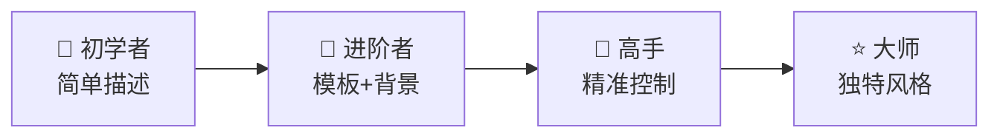

# 第八章：提示词技巧

> 📖 **难度等级**: ⭐⭐⭐ (中等)
> ⏰ **预计阅读时间**: 50分钟
> 🎯 **学习目标**: 掌握和AI高效沟通的技巧

---

## 🎯 什么是提示词（Prompt）？

### 简单解释

**提示词**就是你给AI说的话，是你和AI沟通的方式。

> 💡 **生活类比**：
> - 你和朋友说话 → 对方理解并回应
> - 你给AI说话 → AI理解并回应
> 
> 你说的话 = **提示词**，AI的回应 = **输出结果**

### 好的提示词 vs 坏的提示词

| 坏的提示词 | 好的提示词 |
|------------|-----------|
| "做个网页" | "做一个个人博客网页，包含文章列表、详情页、侧边栏" |
| "改一下" | "把导航栏的颜色从黑色改成深蓝色" |
| "不行" | "这个按钮点击后没有反应，控制台显示xxx错误" |
| "太难看" | "页面背景太单调，请添加一个柔和的渐变色" |

---

## 📋 提示词的黄金法则

### 法则1：要具体（Be Specific）

| ❌ 太笼统 | ✅ 具体明确 |
|---------|-----------|
| "帮我优化这段代码" | "帮我优化这段JavaScript函数，让它运行速度更快，同时保持代码可读性，并解释优化的原因。" |

### 法则2：给背景（Give Context）

| ❌ 缺少背景 | ✅ 提供背景 |
|----------|-----------|
| "写一个登录功能" | "我是一个初学者，正在学习React。请帮我写一个React登录表单，包含用户名和密码输入框，使用函数组件和Hooks，并添加简单的表单验证。" |

### 法则3：分步骤（Break Down）

| ❌ 一次性描述 | ✅ 分步骤完成 |
|-------------|------------|
| "帮我做一个完整的电商网站" | 分成多个小任务依次完成 |

**分步骤示例**：
1. "先帮我创建电商网站的首页，包含商品列表和购物车图标"
2. "现在添加商品详情页，包含商品图片、价格、购买按钮"
3. "添加购物车功能，可以添加和删除商品"
4. ...

### 法则4：给示例（Provide Examples）

| ❌ 没有示例 | ✅ 提供示例 |
|----------|-----------|
| "按照某种格式创建数据" | "创建一个用户数据列表，格式像这样：`{"name": "张三", "age": 25, "email": "zhangsan@example.com"}`，请创建5个这样的用户数据。" |

### 法则5：要结果（Ask for Output）

| ❌ 不指定输出格式 | ✅ 指定输出格式 |
|----------------|---------------|
| "帮我分析这段代码" | "帮我分析这段代码，请按照以下格式输出：1. 代码功能 2. 潜在问题 3. 改进建议 4. 具体修改方案" |

---

## 🎯 实用的提示词模板

### 模板1：创建功能

> 帮我创建一个 [功能名称]
> 
> **需求**：功能1[具体说明]、功能2[具体说明]、功能3[具体说明]
> 
> **技术要求**：使用[技术栈]、代码风格[简洁/详细/注释充分]、错误处理[说明]
> 
> **额外说明**：[其他需要说明的]

**示例**：

> 帮我创建一个登录表单
> 
> **需求**：包含用户名和密码输入框、有记住我选项、登录按钮、忘记密码链接
> 
> **技术要求**：使用React和函数组件、使用Hooks管理状态、添加基本验证（用户名非空、密码至少6位）
> 
> **额外说明**：界面要简洁现代，使用蓝色主题

### 模板2：修复错误

> 我的代码出现了错误
> 
> **错误信息**：[粘贴完整的错误信息]
> 
> **相关代码**：[粘贴相关代码]
> 
> **我试图实现的功能**：[说明你的目标]
> 
> **请帮我**：1. 分析错误原因 2. 解释为什么会出现这个错误 3. 提供修复方案 4. 解释修复方案的原理

**示例**：

> 我的代码出现了错误
> 
> **错误信息**：Uncaught TypeError: Cannot read property 'x' of undefined
> 
> **相关代码**：

```javascript
function calculateDistance(point1, point2) {
    return Math.sqrt(
        Math.pow(point2.x - point1.x, 2) +
        Math.pow(point2.y - point1.y, 2)
    );
}

const point = { y: 5 };
const distance = calculateDistance({ x: 3 }, point);
```

> **我试图实现的功能**：计算两个点之间的距离
> 
> **请帮我**：1. 分析错误原因 2. 解释为什么会出现这个错误 3. 提供修复方案 4. 解释修复方案的原理

### 模板3：优化代码

> 帮我优化以下代码
> 
> **代码**：[粘贴你的代码]
> 
> **优化目标**（选择一项或多项）：提高性能、提高可读性、减少代码量、增强安全性、符合最佳实践
> 
> **其他要求**：不要改变功能、保持原有的逻辑、添加必要的注释说明改动原因

**示例**：

> 帮我优化以下代码
> 
> **代码**：

```javascript
function getFilteredUsers(users) {
    var result = [];
    for (var i = 0; i < users.length; i++) {
        if (users[i].age >= 18 && users[i].age <= 65) {
            result.push(users[i]);
        }
    }
    return result;
}
```

> **优化目标**：提高性能、提高可读性、使用现代JavaScript特性
> 
> **其他要求**：不要改变功能、保持原有的逻辑、添加必要的注释说明改动原因

### 模板4：解释代码

> 请详细解释以下代码
> 
> **代码**：[粘贴代码]
> 
> **请按照以下方式解释**：1. 整体功能：这段代码是做什么的？ 2. 逐步分析：每一行/每一段代码的作用 3. 关键概念：涉及了哪些编程概念 4. 使用场景：什么时候会用到这种代码 5. 注意事项：使用时需要注意什么
> 
> 请用简单易懂的语言解释，像给初学者讲解一样。

**示例**：

> 请详细解释以下代码
> 
> **代码**：

```javascript
const debounce = (func, delay) => {
    let timeoutId;
    return (...args) => {
        clearTimeout(timeoutId);
        timeoutId = setTimeout(() => func.apply(this, args), delay);
    };
};
```

> **请按照以下方式解释**：1. 整体功能：这段代码是做什么的？ 2. 逐步分析：每一行代码的作用 3. 关键概念：涉及了哪些编程概念 4. 使用场景：什么时候会用到这种代码 5. 注意事项：使用时需要注意什么
> 
> 请用简单易懂的语言解释，像给初学者讲解一样。

---

## 🔄 迭代式提示词技巧

### 方法：逐步改进

> **第一次提示**："帮我创建一个登录页面"
> 
> AI生成了页面后...
> 
> **第二次提示**（针对具体问题）："登录按钮太小了，把它放大到原来的1.5倍"
> 
> AI调整后...
> 
> **第三次提示**（继续改进）："现在按钮大小合适了，但是颜色太浅，请改成深蓝色"
> 
> AI继续调整...
> 
> **第四次提示**（完成）："完美！现在帮我把登录框居中显示"
> 
> 完成！

### 迭代的优点

| 优点 | 说明 |
|-----|------|
| 更准确 | 每次只关注一个方面 |
| 更可控 | 可以一步步调整到满意 |
| 更高效 | 避免一次性要求太多 |
| 更容易学习 | 看到每次修改的效果 |

---

## 🎨 编程专用提示词技巧

### 技巧1：指定技术栈

| ❌ 不明确 | ✅ 明确技术栈 |
|---------|-------------|
| "写一个组件" | "用React写一个组件" / "用Vue写一个组件" / "用原生JavaScript写一个函数" |

### 技巧2：指定代码风格

| ❌ 不指定风格 | ✅ 指定风格 |
|-------------|-----------|
| "写一个函数" | "写一个简洁的函数" / "写一个详细注释的函数" / "写一个符合React最佳实践的组件" |

### 技巧3：要求最佳实践

- "请使用React的最佳实践创建这个组件"
- "请遵循现代JavaScript规范"
- "请按照Airbnb的代码规范写代码"

### 技巧4：要求解释和注释

- "写这个函数时，请添加详细的注释解释每一步"
- "创建代码后，请解释整体思路和关键部分"

---

## 📊 不同场景的提示词

### 场景1：创建新项目

> 我要创建一个 [项目类型]
> 
> **项目描述**：[详细描述项目]
> 
> **主要功能**：1. [功能1] 2. [功能2] 3. [功能3]
> 
> **技术偏好**：前端[React/Vue/原生]、后端[Node.js/Python/其他]、样式[CSS/Tailwind/其他]
> 
> **目标用户**：[描述目标用户]
> 
> **请帮我**：1. 制定项目结构 2. 创建基础文件 3. 实现核心功能

### 场景2：添加功能

> 我想给 [当前项目] 添加一个 [功能名称]
> 
> **当前情况**：[描述项目的当前状态]
> 
> **新功能需求**：[详细描述新功能]
> 
> **技术要求**：使用现有的技术栈、不破坏现有功能、保持代码风格一致
> 
> **请**：1. 说明需要修改哪些文件 2. 生成修改后的代码 3. 解释改动的原理

### 场景3：重构代码

> 我想重构 [文件名/模块]
> 
> **问题**：[说明当前代码的问题]
> 
> **目标**：[说明重构的目标]
> 
> **约束条件**：不能改变功能、要向后兼容、要添加测试
> 
> **请**：1. 分析当前代码的问题 2. 提出重构方案 3. 实施重构 4. 对比前后代码

### 场景4：调试代码

> 我的代码有问题
> 
> **错误表现**：[详细描述问题的表现]
> 
> **期望结果**：[描述你期望的结果]
> 
> **相关代码**：[粘贴代码]
> 
> **已尝试的方法**：[说明你已经尝试过的解决方法]
> 
> **请**：1. 分析可能的原因 2. 定位问题所在 3. 提供修复方案 4. 说明如何避免类似问题

---

## ⚠️ 常见的提示词错误

### 错误1：信息太少

| ❌ 信息太少 | ✅ 信息充分 |
|----------|-----------|
| "帮我做一下" | "帮我做一个响应式的导航栏，包含logo、4个菜单项、搜索框，在移动端会收起成汉堡菜单" |

### 错误2：矛盾的要求

| ❌ 矛盾 | ✅ 一致 |
|-------|-------|
| "我要一个很复杂的简单页面" | "我要一个功能丰富但界面简洁的页面" |

### 错误3：一次性要求太多

| ❌ 太多要求 | ✅ 分步要求 |
|----------|----------|
| "帮我做一个完整的电商平台，包含商品展示、购物车、支付、用户系统、订单管理、评论功能、搜索功能、推荐系统、数据统计" | "先帮我做商品展示和购物车功能" |

### 错误4：没有检查输出

**❌ 直接接受**：不检查AI的输出就使用

**✅ 检查验证**：
1. 看AI的输出是否符合要求
2. 测试代码是否能运行
3. 检查有没有明显问题
4. 有问题就让AI修复

---

## 🎯 提示词优化实例

### 实例1：从糟糕到优秀

**版本1（糟糕）**："做个计算器"

**版本2（好一些）**："帮我做一个简单的计算器，能加减乘除"

**版本3（不错）**："帮我做一个网页计算器，包含数字按钮和运算符按钮，可以加减乘除，界面要好看"

**版本4（优秀）**：

> 帮我创建一个功能完整的计算器网页
> 
> **功能需求**：数字按钮0-9、运算符按钮+ - × ÷、清除按钮C、等于按钮=、小数点按钮.
> 
> **界面要求**：网格布局按钮排列整齐、按钮有圆角和阴影、显示屏能显示当前输入和计算结果、响应式设计手机上也能用
> 
> **技术要求**：使用HTML + CSS + JavaScript、代码要清晰易读、添加必要的注释

### 实例2：复杂项目分解

**原始需求**："帮我做一个类似微信的聊天应用"

**分解后**：

1. **步骤1**："先创建聊天应用的界面框架，包含消息列表区域、输入区域、发送按钮"
2. **步骤2**："添加消息显示功能，能显示发送的消息气泡"
3. **步骤3**："添加接收消息的模拟功能，让界面看起来像在聊天"
4. **步骤4**："添加时间戳显示和用户区分"
5. **步骤5**："添加消息输入和发送的完整功能"
6. ...

---

## 🧪 提示词实验方法

### 方法1：对比试验

用不同的提示词，看哪个效果更好：

- **提示词A**："写一个函数"
- **提示词B**："请写一个简洁高效的函数"
- **提示词C**："请帮我写一个JavaScript函数，要求性能优化，代码清晰，添加详细注释"

对比结果，选择最好的！

### 方法2：角色扮演

让AI扮演不同的角色：

- "你现在是一个**资深前端工程师**，请帮我设计这个组件"
- "你现在是一个**初学者老师**，请用最简单的语言解释这段代码"
- "你现在是一个**代码审查员**，请找出这段代码的所有问题"

### 方法3：思维链

让AI展示思考过程：

> "请一步步思考：
> 1. 先分析这个需求
> 2. 然后设计解决方案
> 3. 最后实现代码
> 
> 在每一步都说明你的想法。"

---

## 📝 提示词检查清单

每次让AI写代码前，检查你的提示词：

- [ ] 需求是否清楚明确？
- [ ] 是否提供了必要的背景信息？
- [ ] 技术要求是否说明了？
- [ ] 是否指定了代码风格？
- [ ] 是否需要特定格式？
- [ ] 是否太复杂需要分解？
- [ ] 是否有矛盾的要求？

---

## 🧪 试一试：提示词练习

### 练习1：万能开场咒语

每次开始新对话时，先建立沟通基调：

> 你好！我是一个vibe coding初学者。
> 
> 在接下来的对话中，请你：1. 用简单易懂的话解释 2. 代码要加中文注释 3. 遇到专业术语要解释 4. 一次只做一件事，等我确认再继续
> 
> 我准备好了，你可以先问我想做什么。

### 练习2：功能需求咒语

用这个模板描述任何功能：

> 请帮我实现一个 [功能名称]
> 
> 📝 **基本需求**：[需求1]、[需求2]、[需求3]
> 
> 🎨 **外观要求**：[样式要求]、[颜色/字体偏好]
> 
> ⚙️ **技术要求**：语言[HTML/JavaScript/Python等]、要有中文注释
> 
> 📋 **请按这个顺序来**：1. 先确认你理解了我的需求 2. 给出实现思路 3. 写代码 4. 解释关键代码

**实际使用示例**：

> 请帮我实现一个倒计时器
> 
> 📝 **基本需求**：可以设置倒计时的分钟数、开始后显示剩余时间、时间到了有提醒
> 
> 🎨 **外观要求**：数字要大容易看清、有开始和重置按钮、颜色简洁
> 
> ⚙️ **技术要求**：语言HTML + CSS + JavaScript、要有中文注释
> 
> 📋 **请按这个顺序来**：1. 先确认你理解了我的需求 2. 给出实现思路 3. 写代码 4. 解释关键代码

### 练习3：追问咒语大全

当AI给的不够好时，用这些追问：

| 目的 | 追问咒语 |
|-----|---------|
| 让AI解释更清楚 | "这段代码具体做了什么？请一行一行解释" |
| 让AI改进 | "这个可以更[简洁/美观/快速]吗？" |
| 让AI举例 | "能给我一个实际使用的例子吗？" |
| 让AI对比 | "还有其他方法吗？各有什么优缺点？" |
| 让AI检查 | "这段代码有没有可能出错的地方？" |

### 练习4：魔法咒语速查表

| 场景 | 咒语开头 |
|------|----------|
| 创建新项目 | "请帮我创建一个..." |
| 添加功能 | "请在现有基础上添加..." |
| 修复bug | "我的代码报错了，错误是：..." |
| 解释代码 | "请用最简单的话解释这段代码：..." |
| 优化代码 | "请帮我优化这段代码，让它..." |
| 学习概念 | "请用小学生能懂的话解释什么是..." |
| 对比方案 | "A方案和B方案哪个更好？为什么？" |
| 分步执行 | "请一步一步来，先做...,等我确认再继续" |

---

## ⚠️ 避坑指南：提示词常见错误

### ❌ 错误1：期望AI读心

**错误**："帮我做个好看的"（什么是好看？）

**正确**："帮我做个现代风格的，使用蓝色渐变背景，白色文字，有圆角和阴影"

### ❌ 错误2：一口吃成胖子

**错误**："帮我做一个完整的电商平台"

**正确**：
1. 第1步："先帮我做商品展示页面"
2. 第2步："加上购物车功能"
3. 第3步："加上结算功能"
4. ...（一步步来）

### ❌ 错误3：不给上下文

**错误**："这个按钮怎么不工作？"

**正确**：

> 我的按钮点击没反应。
> 
> **代码如下**：[粘贴相关代码]
> 
> **错误信息**：[如果有的话]
> 
> **期望效果**：点击按钮应该显示一个弹窗

### ❌ 错误4：不验证就用

**错误**：直接复制AI的代码，不测试就上线

**正确**：
1. 先在本地运行测试
2. 检查是否符合预期
3. 不懂的地方问清楚
4. 确认没问题再使用

---

## 🎓 本章小结

### 你学会了：

| 技能 | 内容 |
|-----|------|
| 黄金法则 | 具体、背景、分步、示例、结果 |
| 模板使用 | 创建、修复、优化、解释代码的模板 |
| 迭代改进 | 逐步完善提示词和输出 |
| 场景应对 | 不同场景的提示词技巧 |
| 避免错误 | 常见错误及避免方法 |

### 本章学到的魔法咒语：

| 场景 | 核心咒语 |
|------|----------|
| 开始对话 | "我是初学者，请用简单的话..." |
| 描述需求 | "基本需求+外观要求+技术要求" |
| 追问改进 | "能更[形容词]吗？" |
| 分步执行 | "先做...等我确认再继续" |

### 提示词能力进阶：



### 思考题：

1. 你觉得自己目前的提示词处于哪个水平？
2. 哪个提示词技巧对你最有用？
3. 你想创建自己的提示词模板吗？
4. **动手题**：用"练习2"的模板，描述一个你想做的功能！

---

## 🚀 下一章预告

掌握了提示词技巧，你和AI的沟通会越来越顺畅！下一章我们将学习如何理解AI生成的代码，以及如何调试问题。

准备好成为代码理解高手了吗？让我们继续！🔍

---

## 📚 参考资料

- [Prompt Engineering Best Practices (2026)](https://promptbuilder.cc/blog/prompt-engineering-best-practices-2026)
- [AI Prompt Engineering Best Practices for Real-World Results](https://www.getsnippets.ai/articles/ai-prompt-engineering-best-practices)
- [My LLM coding workflow going into 2026](https://medium.com/@addyosmani/my-llm-coding-workflow-going-into-2026-52fe1681325e)
- [Best practices for prompt engineering](https://claude.com/blog/best-practices-for-prompt-engineering)
- [The Best AI Coding Practices That Actually Work in 2026](https://www.linkedin.com/pulse/best-ai-coding-practices-actually-work-in-2026-big-pixel-llc-thz7c)
- [The Complete Guide to Prompt Engineering in 2026](https://www.erlin.ai/blog/the-complete-guide-to-prompt-engineering-in-2026)
- [Prompt Engineering Guide](https://www.promptingguide.ai/)
