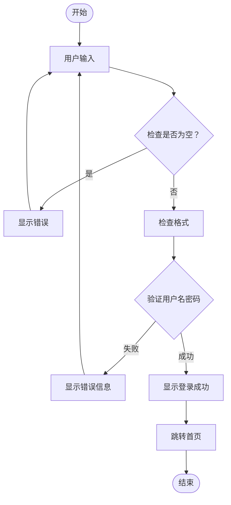
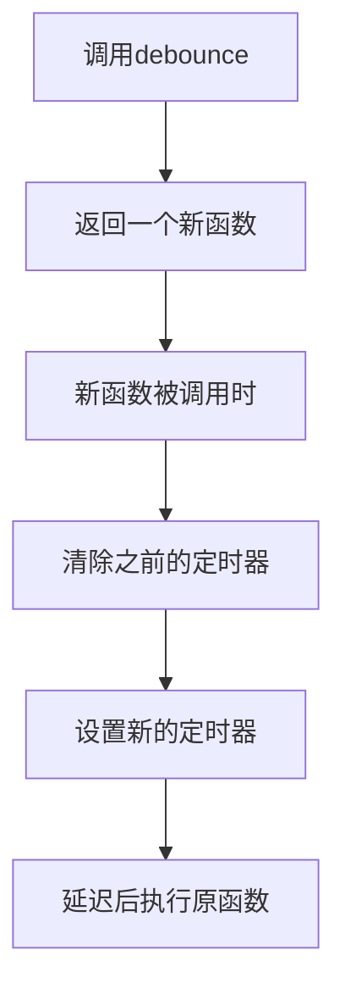
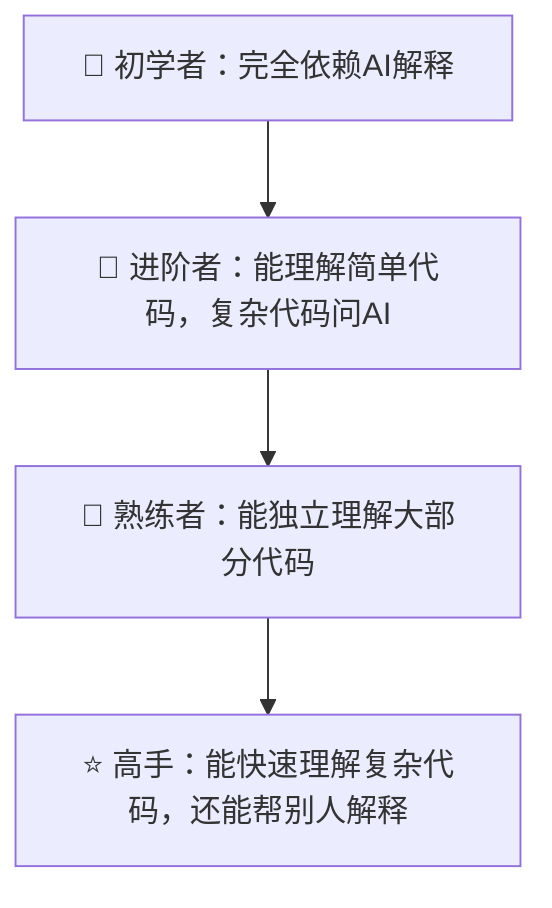

# 第九章：代码理解与调试

> 📖 **难度等级**: ⭐⭐⭐ (中等)
> ⏰ **预计阅读时间**: 45分钟
> 🎯 **学习目标**: 学会理解AI生成的代码，并能调试问题

---

## 🎯 为什么代码理解很重要？

### 现实情况

```
在vibe coding时代：
写代码 → AI帮忙，容易 ✅
理解代码 → 需要自己努力 ⚠️
调试问题 → 更需要理解 ⚠️

结论：
- 代码理解是vibe coding的核心技能
- 不会理解代码就无法真正掌控项目
```

### 代码理解的好处

| 好处 | 说明 |
|-----|------|
| 独立修改 | 理解了才能自己改代码 |
| 避免bug | 理解了才知道哪里容易出错 |
| 优化改进 | 理解了才能优化 |
| 学习成长 | 通过理解代码真正学会编程 |
| 自信满满 | 不依赖AI，自己能解决问题 |

---

## 📖 如何理解代码

### 方法1：逐行阅读法

```
步骤：
1. 从第一行开始
2. 理解每一行的意思
3. 理解行与行之间的关系
4. 理解整体逻辑

示例代码：
function greet(name) {
    const message = "Hello, " + name + "!";
    console.log(message);
    return message;
}

逐行理解：
第1行：定义一个叫greet的函数，接受name参数
第2行：创建一个message变量，拼接待办词和name
第3行：在控制台打印message
第4行：返回message

整体理解：
这个函数的作用是生成问候语并打印出来
```

### 方法2：画流程图法

把代码的逻辑画出来，**示例：登录验证流程**



> 💡 把代码画成流程图，更容易理解！

### 方法3：AI辅助理解法

```
用AI帮你理解代码：

选中代码 → 让AI解释

提示词：
"请详细解释这段代码：
1. 整体功能是什么？
2. 每一步在做什么？
3. 用简单的话解释"
```

### 方法4：添加注释法

```
在代码中添加自己的理解：

// 计算两个数的和
function add(a, b) {
    return a + b;  // 返回a和b相加的结果
}

通过添加注释，验证自己的理解是否正确
```

---

## 🔍 代码理解实战

### 实战1：理解一个事件监听器

```
代码：
button.addEventListener('click', function() {
    alert('按钮被点击了！');
});

理解步骤：

步骤1：识别关键概念
- addEventListener：添加事件监听
- 'click'：点击事件
- function：回调函数

步骤2：理解整体逻辑
给按钮添加一个监听器，
当按钮被点击时，执行函数

步骤3：理解细节
函数的作用是显示一个提示框

步骤4：总结
这段代码让按钮在点击时弹出提示
```

### 实战2：理解一个复杂函数

```
代码：
function debounce(func, delay) {
    let timeoutId;

    return function(...args) {
        clearTimeout(timeoutId);
        timeoutId = setTimeout(() => {
            func.apply(this, args);
        }, delay);
    };
}

理解步骤：

步骤1：问AI
你：请解释这段debounce函数的作用

AI：这是一个防抖函数...
（AI详细解释）

步骤2：自己复述
函数的作用是防止函数在短时间内被多次调用
比如用户快速输入时，只执行最后一次

步骤3：画流程图



步骤4：确认理解
我：所以防抖就是等用户停止操作后再执行？
AI：是的！正确！
```

### 实战3：理解React组件

```
代码：
function Counter() {
    const [count, setCount] = useState(0);

    return (
        <div>
            <p>计数: {count}</p>
            <button onClick={() => setCount(count + 1)}>
                增加
            </button>
        </div>
    );
}

理解步骤：

步骤1：识别框架
- useState：React的Hook

步骤2：理解状态管理
- count：当前计数值
- setCount：更新count的函数
- useState(0)：初始值为0

步骤3：理解渲染
- return JSX：组件返回的内容
- {count}：显示count的值

步骤4：理解交互
- onClick：点击事件
- setCount(count + 1)：点击时加1

步骤5：总结
这是一个简单的计数器组件，
显示当前数值，
点击按钮可以增加
```

---

## 🐛 调试基础

### 什么是调试？

```
调试就是：
发现错误 → 找原因 → 修复错误 → 验证修复

就像医生治病：
症状（错误表现）→ 诊断（找原因）→ 治疗（修复）→ 康复（验证）
```

### 调试的基本步骤

```
步骤1：发现问题
- 程序不运行
- 运行结果不对
- 出现错误信息

步骤2：收集信息
- 查看错误信息
- 复现问题
- 记录问题发生的情况

步骤3：定位原因
- 使用调试工具
- 查看代码逻辑
- 添加日志输出

步骤4：修复问题
- 修改代码
- 确保不引入新问题

步骤5：验证修复
- 测试原来的问题是否解决
- 测试其他功能是否正常
```

---

## 🛠️ 调试技巧

### 技巧1：使用console.log

```
在代码中添加日志输出，查看变量值：

function calculatePrice(price, tax) {
    console.log('price:', price);      // 查看price的值
    console.log('tax:', tax);          // 查看tax的值
    const total = price + price * tax;
    console.log('total:', total);      // 查看计算结果
    return total;
}

通过日志，可以看到每个步骤的值，找出问题所在
```

### 技巧2：使用浏览器开发者工具

```
打开浏览器开发者工具：
- Chrome: F12 或 Ctrl/Cmd + Shift + I

常用功能：
1. Console：查看日志和错误
2. Elements：查看页面元素
3. Sources：设置断点调试
4. Network：查看网络请求

断点调试：
1. 打开Sources
2. 找到要调试的代码
3. 点击行号设置断点
4. 刷新页面触发断点
5. 单步执行查看变量值
```

### 技巧3：使用AI调试

```
把错误信息给AI：

你：
我的代码报错了：
TypeError: Cannot read property 'x' of undefined

相关代码：
function getPosition(obj) {
    return obj.x;  // 错误在这里
}

const point = undefined;
const pos = getPosition(point);

AI会：
1. 分析错误原因
2. 指出obj可能是undefined
3. 提供修复方案
```

### 技巧4：缩小范围

```
问题太大不知道从哪开始？

缩小范围的方法：

方法1：注释掉部分代码
// 注释这一块
// 看问题是否消失

方法2：简化数据
// 用简单的数据测试
const data = [];  // 而不是复杂的数据

方法3：单独测试
// 把有问题的代码单独拿出来测试
```

---

## 🎯 常见错误类型和解决

### 错误1：ReferenceError（引用错误）

```
错误信息：
ReferenceError: xxx is not defined

原因：使用了未定义的变量

示例：
console.log(myVariable);  // myVariable未定义

解决：
1. 检查变量名是否拼写正确
2. 确保变量在使用前已定义
3. 检查作用域（是否在正确的作用域内）

正确：
const myVariable = 'Hello';
console.log(myVariable);  // ✅
```

### 错误2：TypeError（类型错误）

```
错误信息：
TypeError: Cannot read property 'x' of undefined

原因：尝试访问undefined的属性

示例：
const obj = undefined;
console.log(obj.x);  // ❌ 错误

解决：
1. 检查对象是否存在
2. 使用可选链操作符

正确：
const obj = { x: 10 };
console.log(obj?.x);  // ✅ 使用可选链
```

### 错误3：SyntaxError（语法错误）

```
错误信息：
SyntaxError: Unexpected token

原因：代码语法错误

示例：
function test() {
    console.log('Hello'
    // 缺少右括号
}

解决：
1. 检查括号是否匹配
2. 检查引号是否配对
3. 检查分号是否正确

正确：
function test() {
    console.log('Hello');  // ✅
}
```

### 错误4：逻辑错误（最难发现）

```
没有错误信息，但结果不对

示例：
// 想要计算1到10的和
function sum(n) {
    let total = 0;
    for (let i = 0; i < n; i++) {  // 从0开始，少加了1
        total += i;
    }
    return total;
}

结果：
sum(10) = 45  // 正确应该是55

解决：
1. 仔细检查逻辑
2. 添加console.log查看每一步
3. 用小数据测试
4. 使用AI帮忙分析

修复：
for (let i = 1; i <= n; i++) {  // ✅ 从1开始，<=n
```

---

## 🔧 AI辅助调试

### 让AI帮你调试

```
模板1：错误诊断
"我的代码出现了错误

错误信息：
[粘贴完整错误信息]

相关代码：
```[语言]
[粘贴代码]
```

请帮我：
1. 分析错误原因
2. 解释为什么会出现
3. 提供修复方案"
```

```
模板2：功能不正常
"我的代码运行了，但结果不对

预期结果：
[说明你期望的结果]

实际结果：
[说明实际得到的结果]

相关代码：
[粘贴代码]

请帮我找出问题所在"
```

```
模板3：性能问题
"我的代码运行很慢

代码：
[粘贴代码]

问题描述：
[描述性能问题]

请帮我优化这段代码，并解释优化原理"
```

### 调试对话示例

```
你：我的搜索功能很慢，每次要等好几秒

相关代码：
```javascript
function searchProducts(query, products) {
    const results = [];
    for (let i = 0; i < products.length; i++) {
        if (products[i].name.includes(query)) {
            results.push(products[i]);
        }
    }
    return results;
}
```

products数组有10000个商品

AI：问题分析：

1. **时间复杂度问题**
   - 每次搜索都要遍历整个数组
   - 10000次循环，每次执行includes
   - 复杂度是O(n)

2. **性能优化方案**
   - 预先建立索引
   - 使用更高效的数据结构

优化后的代码：
```javascript
// 预先建立索引
function buildIndex(products) {
    const index = {};
    for (const product of products) {
        for (const char of product.name) {
            index[char] = index[char] || [];
            index[char].push(product);
        }
    }
    return index;
}

// 使用索引搜索
function searchProducts(query, index) {
    let results = index[query[0]] || [];
    for (let i = 1; i < query.length; i++) {
        results = results.filter(p =>
            p.name.includes(query[i])
        );
    }
    return results;
}
```

这样搜索速度会快很多！

你：太好了！但这个优化有点复杂，
有没有简单一点的方法？

AI：理解！这里有个简化版本：

```javascript
function searchProducts(query, products) {
    return products.filter(product =>
        product.name.toLowerCase().includes(query.toLowerCase())
    );
}
```

虽然还是O(n)，但：
1. 代码更简洁
2. 使用filter更易读
3. 统一小写避免大小写问题

如果数据量不大（<5000），这个就够用了！
```

---

## 📝 调试实践清单

每次遇到问题，按这个清单来：

```
☐ 第一步：收集信息
   [ ] 记录错误信息
   [ ] 复现问题
   [ ] 记录问题发生的环境

☐ 第二步：初步分析
   [ ] 错误类型是什么？
   [ ] 可能的原因有哪些？
   [ ] 之前的类似问题怎么解决的？

☐ 第三步：尝试解决
   [ ] 查看错误代码附近的代码
   [ ] 添加日志查看变量值
   [ ] 使用断点调试

☐ 第四步：寻求帮助
   [ ] 问我AI，用上面的模板
   [ ] 搜索相似问题
   [ ] 查看项目文档

☐ 第五步：验证修复
   [ ] 原问题是否解决？
   [ ] 其他功能是否正常？
   [ ] 是否引入新问题？

☐ 第六步：总结经验
   [ ] 记录问题和解决方案
   [ ] 思考如何避免类似问题
   [ ] 分享给团队（如果适用）
```

---

## 🧪 试一试：调试实战练习

### 练习1：找出下面代码的bug

这段代码想要计算数组的平均值，但有问题：

```javascript
function calculateAverage(numbers) {
    let sum = 0;
    for (let i = 0; i <= numbers.length; i++) {
        sum += numbers[i];
    }
    return sum / numbers.length;
}

// 测试
console.log(calculateAverage([10, 20, 30])); // 应该输出 20
```

**先自己找找问题**，然后用这个魔法咒语验证：

```prompt
这段代码有bug，请帮我：
1. 找出问题在哪里
2. 解释为什么这是个bug
3. 给出修复后的代码
4. 告诉我怎么避免类似错误

代码：
[粘贴上面的代码]
```

### 练习2：console.log调试大法

当代码不工作时，用console.log找问题：

```javascript
function processUser(user) {
    console.log('1. 开始处理用户:', user);              // 检查输入
    
    const name = user.name.trim();
    console.log('2. 处理后的名字:', name);              // 检查中间值
    
    if (name.length > 0) {
        console.log('3. 名字有效，继续处理');            // 检查分支
        return { success: true, name };
    } else {
        console.log('3. 名字为空，返回错误');           // 检查分支
        return { success: false, error: '名字不能为空' };
    }
}

// 测试
processUser({ name: '  小明  ' });
```

**试一试**：在你的项目中加入类似的console.log，观察程序的执行流程。

### 练习3：AI调试咒语模板

遇到bug时，复制这个模板：

```prompt
🐛 我的代码出bug了，请帮我诊断！

📝 问题描述：
[用一两句话说明问题]

💻 相关代码：
```javascript
[粘贴出问题的代码]
```

❌ 错误信息（如果有）：
[复制粘贴错误信息]

✅ 期望的结果：
[说明你期望代码做什么]

❓ 实际的结果：
[说明代码实际做了什么]

请帮我：
1. 找出问题原因
2. 给出修复方案
3. 解释为什么会出这个问题
4. 告诉我怎么避免
```

### 练习4：浏览器开发者工具速查

| 快捷键 | 功能 | 用途 |
|--------|------|------|
| F12 | 打开开发者工具 | 开始调试 |
| Ctrl+Shift+I | 同上 | 开始调试 |
| 在Console标签 | 查看日志和错误 | 看console.log输出 |
| 在Elements标签 | 查看HTML结构 | 检查页面元素 |
| 在Sources标签 | 查看和调试代码 | 设断点调试 |
| 在Network标签 | 查看网络请求 | 检查API调用 |

---

## ⚠️ 避坑指南：调试常见错误

### ❌ 错误1：只看错误信息的第一行

**错误做法**：只看 "TypeError" 就放弃了

**正确做法**：
```
完整阅读错误信息：
1. 错误类型（TypeError、ReferenceError等）
2. 错误描述（什么不能读取、什么未定义）
3. 出错位置（文件名和行号）
4. 调用栈（错误是从哪里触发的）
```

### ❌ 错误2：改代码不保存就测试

**错误做法**：改了代码，刷新页面，发现没效果（因为没保存）

**正确做法**：
```
1. 修改代码
2. 按 Ctrl+S 保存
3. 刷新页面测试
4. 确认是最新的代码在运行
```

### ❌ 错误3：一次改太多

**错误做法**：一下子改了很多地方，不知道是哪个改动解决了问题

**正确做法**：
```
1. 一次只改一个地方
2. 改完就测试
3. 有效果就记录下来
4. 没效果就撤销，试下一个
```

### ❌ 错误4：不使用开发者工具

**错误做法**：代码出错了，只盯着代码看

**正确做法**：
```
1. 按F12打开开发者工具
2. 查看Console面板是否有红色错误
3. 点击错误可以跳转到出错位置
4. 善用断点调试复杂问题
```

### 💡 调试黄金法则

```
1. 首先读懂错误信息（AI可以帮你解读）
2. 用 console.log 跟踪程序执行
3. 一次只改一个地方
4. 改完保存再测试
5. 解决后思考为什么会出错
```

---

## 🎓 本章小结

### 你学会了：

| 技能 | 内容 |
|-----|------|
| 代码理解 | 逐行阅读、流程图、AI辅助、添加注释 |
| 调试基础 | 发现、定位、修复、验证的流程 |
| 调试技巧 | console.log、开发者工具、AI调试、缩小范围 |
| 错误类型 | ReferenceError、TypeError、SyntaxError、逻辑错误 |
| AI调试 | 使用模板让AI帮忙诊断问题 |

### 本章学到的魔法咒语：

| 场景 | 咒语要点 |
|------|----------|
| 解释代码 | "请逐行解释这段代码的作用" |
| 找bug | "问题描述+代码+错误信息+期望结果" |
| 性能优化 | "这段代码运行很慢，请帮我优化" |
| 学习调试 | "请教我怎么用console.log调试" |

### 代码理解能力提升路径：



### 思考题：

1. 你觉得代码理解最难的地方是什么？
2. 你最常遇到的错误类型是什么？
3. 怎么提高自己的调试能力？
4. **动手题**：完成"练习1"，找出代码中的bug！

---

## 🚀 下一章预告

你已经学会代码理解和调试了！下一章我们将进入实战篇，从零开始完成一个真实的网页项目！

准备好动手做了吗？让我们开始实战！💪

---

## 📚 参考资料

- [Best AI Coding Assistant for Beginners: 2026 Complete Guide](https://zoer.ai/posts/zoer/best-ai-coding-assistant-beginners-guide-2026)
- [How to Learn Coding in 2026: A Practical Guide](https://dev.to/farhadrahimiklie/how-to-learn-coding-in-2026-a-practical-guide-that-actually-works-3f2l)
- [Complete Beginner's Guide to Building AI Agents](https://langchain-tutorials.github.io/langgraph-tutorial-2026-beginners-guide/)
- [The Ultimate AI Coding Guide for Beginners](https://github.com/techcow2/Tips-Tricks-for-AI-Coder)
- [My LLM coding workflow going into 2026](https://medium.com/@addyosmani/my-llm-coding-workflow-going-into-2026-52fe1681325e)
- [AI Debugging for Developers: A Beginner's Guide](https://www.linkedin.com/posts/simon-mumina-7a734022b_ai-powered-debugging-a-beginners-guide-activity-7418346103600730112--M16)
- [Getting Started with AI in 2026: The New Path](https://yuv.ai/learn/getting-started-ai-2026)
