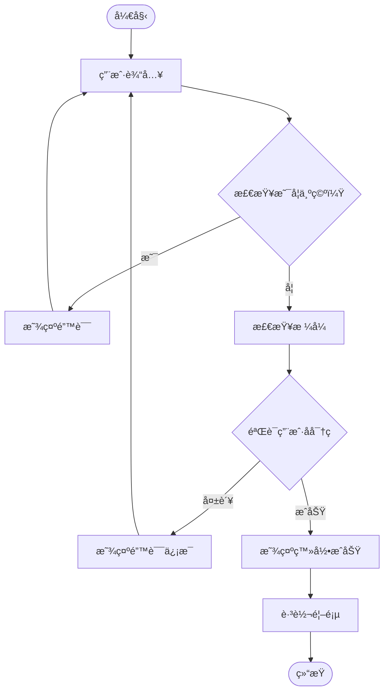
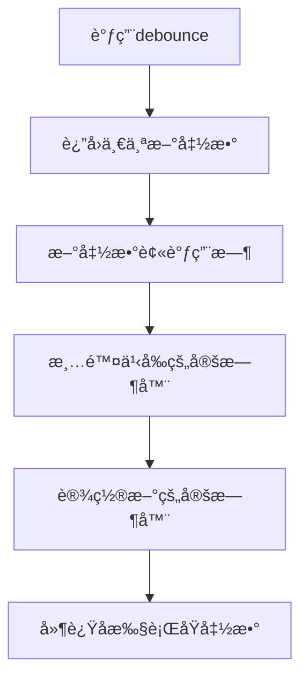
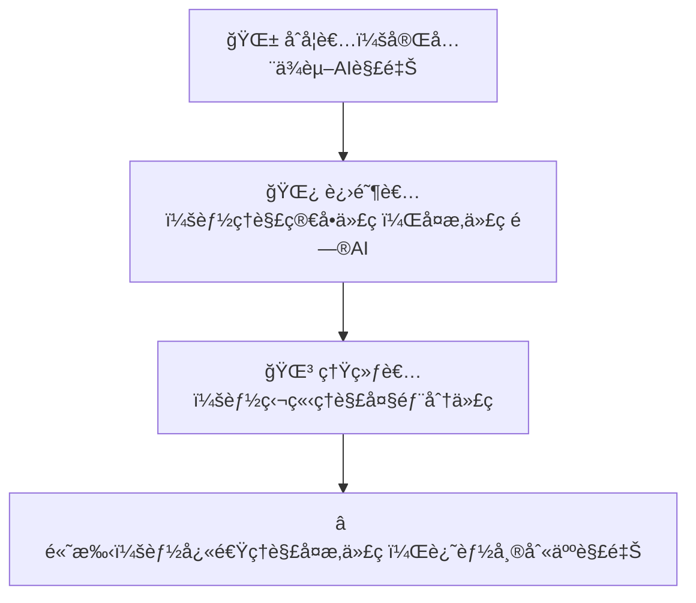

# 第ä¹ç« ï¼šä»£ç ç†è§£ä¸è°ƒè¯•

> 📖 **难度等级**: â­â­â­ (中等)
> Ⱐ**预计阅读时间**: 45分钟
> 🯠**学习目标**: 学会ç†è§£AI生æˆçš„代ç ï¼Œå¹¶èƒ½è°ƒè¯•é—®é¢˜

---

## 🯠为什么代ç ç†è§£å¾ˆé‡è¦ï¼Ÿ

### ç°å®æƒ…况

```
在vibe coding时代：
å†™ä»£ç  â†’ AI帮忙，容易 ✅
ç†è§£ä»£ç  → 需è¦è‡ªå·±åŠªåŠ› âš ï¸
调试问题 → 更需è¦ç†è§£ âš ï¸

结论：
- 代ç ç†è§£æ˜¯vibe coding的核心技能
- ä¸ä¼šç†è§£ä»£ç å°±æ— æ³•çœŸæ­£æŒæ§é¡¹ç›®
```

### 代ç ç†è§£çš„好处

| 好处 | è¯´æ˜ |
|-----|------|
| 独立修改 | ç†è§£äº†æ‰èƒ½è‡ªå·±æ”¹ä»£ç  |
| é¿å…bug | ç†è§£äº†æ‰çŸ¥é“哪里容易出错 |
| 优化改进 | ç†è§£äº†æ‰èƒ½ä¼˜åŒ– |
| 学习æˆé•¿ | 通过ç†è§£ä»£ç çœŸæ­£å­¦ä¼šç¼–程 |
| 自信满满 | ä¸ä¾èµ–AI，自己能解决问题 |

---

## 📖 如何ç†è§£ä»£ç 

### 方法1：é€è¡Œé˜…读法

**步骤**：
1. ä»ç¬¬ä¸€è¡Œå¼€å§‹
2. ç†è§£æ¯ä¸€è¡Œçš„æ„æ€
3. ç†è§£è¡Œä¸è¡Œä¹‹é—´çš„关系
4. ç†è§£æ•´ä½“逻辑

**示例代ç **：

```javascript
function greet(name) {
    const message = "Hello, " + name + "!";
    console.log(message);
    return message;
}
```

**é€è¡Œç†è§£**：

| 行数 | ä»£ç  | å«ä¹‰ |
|:---:|------|------|
| 第1è¡Œ | `function greet(name)` | 定义一个å«greet的函数，æ¥å—nameå‚æ•° |
| 第2è¡Œ | `const message = ...` | 创建一个messageå˜é‡ï¼Œæ‹¼æ¥é—®å€™è¯å’Œname |
| 第3è¡Œ | `console.log(message)` | 在æ§åˆ¶å°æ‰“å°message |
| 第4è¡Œ | `return message` | è¿”å›message |

**整体ç†è§£**：这个函数的作用是生æˆé—®å€™è¯­å¹¶æ‰“å°å‡ºæ¥

### 方法2：画æµç¨‹å›¾æ³•

把代ç çš„逻辑画出æ¥ï¼Œ**示例：登录验è¯æµç¨‹**



> 💡 把代ç ç”»æˆæµç¨‹å›¾ï¼Œæ›´å®¹æ˜“ç†è§£ï¼

### 方法3：AI辅助ç†è§£æ³•

**用AI帮你ç†è§£ä»£ç **ï¼šé€‰ä¸­ä»£ç  â†’ 让AI解释

**æ示è¯æ¨¡æ¿**：

```prompt
请详细解释这段代ç ï¼š
1. 整体功能是什么？
2. æ¯ä¸€æ­¥åœ¨åšä»€ä¹ˆï¼Ÿ
3. 用简å•çš„è¯è§£é‡Š
```

### 方法4：添加注释法

**在代ç ä¸­æ·»åŠ è‡ªå·±çš„ç†è§£**：

```javascript
// 计算两个数的和
function add(a, b) {
    return a + b;  // è¿”å›aå’Œb相加的结æœ
}
```

通过添加注释，验è¯è‡ªå·±çš„ç†è§£æ˜¯å¦æ­£ç¡®

---

## 🔠代ç ç†è§£å®æˆ˜

### å®æˆ˜1：ç†è§£ä¸€ä¸ªäº‹ä»¶ç›‘å¬å™¨

**代ç **：

```javascript
button.addEventListener('click', function() {
    alert('按钮被点击了ï¼');
});
```

**ç†è§£æ­¥éª¤**：

1. **识别关键概念**：`addEventListener`（添加事件监å¬ï¼‰ã€`'click'`（点击事件）ã€`function`（å›è°ƒå‡½æ•°ï¼‰
2. **ç†è§£æ•´ä½“逻辑**：给按钮添加一个监å¬å™¨ï¼Œå½“按钮被点击时，执行函数
3. **ç†è§£ç»†èŠ‚**：函数的作用是显示一个æ示框
4. **总结**：这段代ç è®©æŒ‰é’®åœ¨ç‚¹å‡»æ—¶å¼¹å‡ºæ示

### å®æˆ˜2：ç†è§£ä¸€ä¸ªå¤æ‚函数

**代ç **：

```javascript
function debounce(func, delay) {
    let timeoutId;

    return function(...args) {
        clearTimeout(timeoutId);
        timeoutId = setTimeout(() => {
            func.apply(this, args);
        }, delay);
    };
}
```

**ç†è§£æ­¥éª¤**：

1. **问AI**：
   > **你**：请解释这段debounce函数的作用
   > 
   > **AI**：这是一个防抖函数...（AI详细解释）

2. **自己å¤è¿°**：函数的作用是防止函数在短时间内被多次调用，比如用户快速输入时，åªæ‰§è¡Œæœ€å一次

3. **ç”»æµç¨‹å›¾**：



4. **确认ç†è§£**：
   > **我**：所以防抖就是等用户åœæ­¢æ“作åå†æ‰§è¡Œï¼Ÿ
   > 
   > **AI**：是的ï¼æ­£ç¡®ï¼

### å®æˆ˜3：ç†è§£React组件

**代ç **：

```jsx
function Counter() {
    const [count, setCount] = useState(0);

    return (
        <div>
            <p>计数: {count}</p>
            <button onClick={() => setCount(count + 1)}>
                å¢åŠ 
            </button>
        </div>
    );
}
```

**ç†è§£æ­¥éª¤**：

1. **识别框æ¶**：`useState` 是 React çš„ Hook
2. **ç†è§£çŠ¶æ€ç®¡ç†**：
   - `count`：当å‰è®¡æ•°å€¼
   - `setCount`：更新 count 的函数
   - `useState(0)`：åˆå§‹å€¼ä¸º 0
3. **ç†è§£æ¸²æŸ“**：
   - `return JSX`：组件返å›çš„内容
   - `{count}`：显示 count 的值
4. **ç†è§£äº¤äº’**：
   - `onClick`：点击事件
   - `setCount(count + 1)`：点击时加1
5. **总结**：这是一个简å•çš„计数器组件，显示当å‰æ•°å€¼ï¼Œç‚¹å‡»æŒ‰é’®å¯ä»¥å¢åŠ 

---

## 🛠调试基础

### 什么是调试？

**调试就是**：å‘ç°é”™è¯¯ → 找åŸå›  → ä¿®å¤é”™è¯¯ → 验è¯ä¿®å¤

> 💡 **生活类比**：就åƒåŒ»ç”Ÿæ²»ç—… —— 症状（错误表ç°ï¼‰â†’ 诊断（找åŸå› ï¼‰â†’ 治疗（修å¤ï¼‰â†’ 康å¤ï¼ˆéªŒè¯ï¼‰

### 调试的基本步骤

| 步骤 | æ“作 | è¯´æ˜ |
|:---:|------|------|
| **1. å‘ç°é—®é¢˜** | 程åºä¸è¿è¡Œã€è¿è¡Œç»“æœä¸å¯¹ã€å‡ºç°é”™è¯¯ä¿¡æ¯ | 识别异常 |
| **2. 收集信æ¯** | 查看错误信æ¯ã€å¤ç°é—®é¢˜ã€è®°å½•æƒ…况 | è·å–线索 |
| **3. 定ä½åŸå› ** | 使用调试工具ã€æŸ¥çœ‹ä»£ç é€»è¾‘ã€æ·»åŠ æ—¥å¿— | 找到根因 |
| **4. ä¿®å¤é—®é¢˜** | 修改代ç ã€ç¡®ä¿ä¸å¼•å…¥æ–°é—®é¢˜ | 解决问题 |
| **5. 验è¯ä¿®å¤** | 测试åŸé—®é¢˜æ˜¯å¦è§£å†³ã€å…¶ä»–功能是å¦æ­£å¸¸ | ç¡®è®¤ä¿®å¤ |

---

## ğŸ› ï¸ è°ƒè¯•æŠ€å·§

### 技巧1：使用console.log

**在代ç ä¸­æ·»åŠ æ—¥å¿—输出，查看å˜é‡å€¼**：

```javascript
function calculatePrice(price, tax) {
    console.log('price:', price);      // 查看price的值
    console.log('tax:', tax);          // 查看tax的值
    const total = price + price * tax;
    console.log('total:', total);      // 查看计算结æœ
    return total;
}
```

> 💡 通过日志，å¯ä»¥çœ‹åˆ°æ¯ä¸ªæ­¥éª¤çš„值，找出问题所在

### 技巧2：使用æµè§ˆå™¨å¼€å‘者工具

**打开方å¼**：`F12` 或 `Ctrl/Cmd + Shift + I`

| 功能 | 作用 |
|------|------|
| **Console** | 查看日志和错误 |
| **Elements** | 查看页é¢å…ƒç´  |
| **Sources** | 设置断点调试 |
| **Network** | 查看网络请求 |

**断点调试步骤**：打开 Sources → 找到è¦è°ƒè¯•çš„ä»£ç  â†’ 点击行å·è®¾ç½®æ–­ç‚¹ → 刷新页é¢è§¦å‘断点 → å•æ­¥æ‰§è¡ŒæŸ¥çœ‹å˜é‡å€¼

### 技巧3：使用AI调试

**把错误信æ¯ç»™AI**：

> **ä½ **：我的代ç æŠ¥é”™äº†ï¼š`TypeError: Cannot read property 'x' of undefined`
> 
> 相关代ç ï¼š
> ```javascript
> function getPosition(obj) {
>     return obj.x;  // 错误在这里
> }
> const point = undefined;
> const pos = getPosition(point);
> ```
> 
> **AI会**：1. 分æ错误åŸå› ï¼›2. 指出 `obj` å¯èƒ½æ˜¯ `undefined`ï¼›3. æ供修å¤æ–¹æ¡ˆ

### 技巧4：缩å°èŒƒå›´

**问题太大ä¸çŸ¥é“ä»å“ªå¼€å§‹ï¼Ÿ**

| 方法 | æ“作 |
|------|------|
| **方法1：注释æ‰éƒ¨åˆ†ä»£ç ** | 注释一å—代ç ï¼Œçœ‹é—®é¢˜æ˜¯å¦æ¶ˆå¤± |
| **方法2：简化数æ®** | 用简å•çš„æ•°æ®æµ‹è¯•ï¼ˆå¦‚ `const data = []`）|

| **方法3：å•ç‹¬æµ‹è¯•** | 把有问题的代ç å•ç‹¬æ‹¿å‡ºæ¥æµ‹è¯• |

---

## 🯠常è§é”™è¯¯ç±»å‹å’Œè§£å†³

### 错误1：ReferenceError（引用错误）

**错误信æ¯**：`ReferenceError: xxx is not defined`

**åŸå› **：使用了未定义的å˜é‡

| ⌠错误示例 | ✅ 正确写法 |
|-----------|-----------|
| `console.log(myVariable);` | `const myVariable = 'Hello'; console.log(myVariable);` |

**解决方法**：1. 检查å˜é‡å是å¦æ‹¼å†™æ­£ç¡®ï¼›2. ç¡®ä¿å˜é‡åœ¨ä½¿ç”¨å‰å·²å®šä¹‰ï¼›3. 检查作用域

### 错误2：TypeError（类å‹é”™è¯¯ï¼‰

**错误信æ¯**：`TypeError: Cannot read property 'x' of undefined`

**åŸå› **：å°è¯•è®¿é—® undefined çš„å±æ€§

| ⌠错误示例 | ✅ 正确写法 |
|-----------|-----------|
| `const obj = undefined; console.log(obj.x);` | `const obj = { x: 10 }; console.log(obj?.x);` |

**解决方法**：1. 检查对象是å¦å­˜åœ¨ï¼›2. 使用å¯é€‰é“¾æ“作符 `?.`

### 错误3：SyntaxError（语法错误）

**错误信æ¯**：`SyntaxError: Unexpected token`

**åŸå› **：代ç è¯­æ³•é”™è¯¯ï¼ˆæ‹¬å·ä¸åŒ¹é…ã€å¼•å·ä¸é…对ã€åˆ†å·ç¼ºå¤±ç­‰ï¼‰

**解决方法**：1. 检查括å·æ˜¯å¦åŒ¹é…ï¼›2. 检查引å·æ˜¯å¦é…对；3. 检查分å·æ˜¯å¦æ­£ç¡®

### 错误4：逻辑错误（最难å‘ç°ï¼‰

**特点**：没有错误信æ¯ï¼Œä½†ç»“æœä¸å¯¹

**示例**：想计算1到10的和，结æœå´æ˜¯45（正确应该是55）

```javascript
// ⌠错误：ä»0开始，少加了1
for (let i = 0; i < n; i++) { total += i; }

// ✅ ä¿®å¤ï¼šä»1开始，<=n
for (let i = 1; i <= n; i++) { total += i; }
```

**解决方法**：1. 仔细检查逻辑；2. 添加 `console.log` 查看æ¯ä¸€æ­¥ï¼›3. 用å°æ•°æ®æµ‹è¯•ï¼›4. 使用AI帮忙分æ

---

## 🔧 AI辅助调试

### 让AI帮你调试

**模æ¿1：错误诊断**

```prompt
我的代ç å‡ºç°äº†é”™è¯¯
错误信æ¯ï¼š[粘贴完整错误信æ¯]
相关代ç ï¼š[粘贴代ç ]
请帮我：1. 分æ错误åŸå› ï¼›2. 解释为什么会出ç°ï¼›3. æ供修å¤æ–¹æ¡ˆ
```

**模æ¿2：功能ä¸æ­£å¸¸**

```prompt
我的代ç è¿è¡Œäº†ï¼Œä½†ç»“æœä¸å¯¹
预期结æœï¼š[说æ˜ä½ æœŸæœ›çš„结æœ]
å®é™…结æœï¼š[说æ˜å®é™…得到的结æœ]
相关代ç ï¼š[粘贴代ç ]
请帮我找出问题所在
```

**模æ¿3：性能问题**

```prompt
我的代ç è¿è¡Œå¾ˆæ…¢
代ç ï¼š[粘贴代ç ]
问题æ述：[æ述性能问题]
请帮我优化这段代ç ï¼Œå¹¶è§£é‡Šä¼˜åŒ–åŸç†
```

### 调试对è¯ç¤ºä¾‹

> **ä½ **：我的æœç´¢åŠŸèƒ½å¾ˆæ…¢ï¼Œæ¯æ¬¡è¦ç­‰å¥½å‡ ç§’。products 数组有10000个商å“。
> 
> 相关代ç ï¼š

```javascript
function searchProducts(query, products) {
    const results = [];
    for (let i = 0; i < products.length; i++) {
        if (products[i].name.includes(query)) {
            results.push(products[i]);
        }
    }
    return results;
}
```

> **AI**：问题分æ：
> 1. **时间å¤æ‚度问题**：æ¯æ¬¡æœç´¢éƒ½è¦éå†æ•´ä¸ªæ•°ç»„，10000次循ç¯ï¼Œå¤æ‚度是 O(n)
> 2. **性能优化方案**：预先建立索引ã€ä½¿ç”¨æ›´é«˜æ•ˆçš„æ•°æ®ç»“æ„

**优化å的代ç **：

```javascript
// 预先建立索引
function buildIndex(products) {
    const index = {};
    for (const product of products) {
        for (const char of product.name) {
            index[char] = index[char] || [];
            index[char].push(product);
        }
    }
    return index;
}

// 使用索引æœç´¢
function searchProducts(query, index) {
    let results = index[query[0]] || [];
    for (let i = 1; i < query.length; i++) {
        results = results.filter(p => p.name.includes(query[i]));
    }
    return results;
}
```

> **ä½ **：太好了ï¼ä½†è¿™ä¸ªä¼˜åŒ–有点å¤æ‚，有没有简å•ä¸€ç‚¹çš„方法？
> 
> **AI**：ç†è§£ï¼è¿™é‡Œæœ‰ä¸ªç®€åŒ–版本：

```javascript
function searchProducts(query, products) {
    return products.filter(product =>
        product.name.toLowerCase().includes(query.toLowerCase())
    );
}
```

> 虽然还是 O(n)，但：1. 代ç æ›´ç®€æ´ï¼›2. 使用 filter 更易读；3. 统一å°å†™é¿å…大å°å†™é—®é¢˜ã€‚如æœæ•°æ®é‡ä¸å¤§ï¼ˆ<5000），这个就够用了ï¼

---

## 📠调试å®è·µæ¸…å•

æ¯æ¬¡é‡åˆ°é—®é¢˜ï¼ŒæŒ‰è¿™ä¸ªæ¸…å•æ¥ï¼š

| 步骤 | 检查项 |
|:---:|--------|
| **第一步：收集信æ¯** | â˜ è®°å½•é”™è¯¯ä¿¡æ¯ â˜ å¤ç°é—®é¢˜ ☠记录问题å‘生的ç¯å¢ƒ |
| **第二步：åˆæ­¥åˆ†æ** | ☠错误类å‹æ˜¯ä»€ä¹ˆï¼Ÿ ☠å¯èƒ½çš„åŸå› æœ‰å“ªäº›ï¼Ÿ ☠之å‰çš„类似问题æ€ä¹ˆè§£å†³çš„？ |
| **第三步：å°è¯•è§£å†³** | ☠查看错误代ç é™„è¿‘çš„ä»£ç  â˜ æ·»åŠ æ—¥å¿—æŸ¥çœ‹å˜é‡å€¼ ☠使用断点调试 |
| **第四步：寻求帮助** | ☠问AI（用上é¢çš„模æ¿ï¼‰ ☠æœç´¢ç›¸ä¼¼é—®é¢˜ ☠查看项目文档 |
| **第五步：验è¯ä¿®å¤** | ☠åŸé—®é¢˜æ˜¯å¦è§£å†³ï¼Ÿ ☠其他功能是å¦æ­£å¸¸ï¼Ÿ ☠是å¦å¼•å…¥æ–°é—®é¢˜ï¼Ÿ |
| **第六步：总结ç»éªŒ** | ☠记录问题和解决方案 ☠æ€è€ƒå¦‚何é¿å…类似问题 ☠分享给团队 |

---

## 🧪 试一试：调试å®æˆ˜ç»ƒä¹ 

### 练习1：找出下é¢ä»£ç çš„bug

这段代ç æƒ³è¦è®¡ç®—数组的平å‡å€¼ï¼Œä½†æœ‰é—®é¢˜ï¼š

```javascript
function calculateAverage(numbers) {
    let sum = 0;
    for (let i = 0; i <= numbers.length; i++) {
        sum += numbers[i];
    }
    return sum / numbers.length;
}

// 测试
console.log(calculateAverage([10, 20, 30])); // 应该输出 20
```

**先自己找找问题**，然å用这个魔法咒语验è¯ï¼š

```prompt
这段代ç æœ‰bug，请帮我：
1. 找出问题在哪里
2. 解释为什么这是个bug
3. 给出修å¤å的代ç 
4. 告诉我æ€ä¹ˆé¿å…类似错误

代ç ï¼š
[粘贴上é¢çš„代ç ]
```

### 练习2：console.log调试大法

当代ç ä¸å·¥ä½œæ—¶ï¼Œç”¨console.log找问题：

```javascript
function processUser(user) {
    console.log('1. 开始处ç†ç”¨æˆ·:', user);              // 检查输入
    
    const name = user.name.trim();
    console.log('2. 处ç†åçš„åå­—:', name);              // 检查中间值
    
    if (name.length > 0) {
        console.log('3. å字有效，继续处ç†');            // 检查分支
        return { success: true, name };
    } else {
        console.log('3. å字为空，返å›é”™è¯¯');           // 检查分支
        return { success: false, error: 'åå­—ä¸èƒ½ä¸ºç©º' };
    }
}

// 测试
processUser({ name: '  å°æ˜  ' });
```

**试一试**：在你的项目中加入类似的console.log，观察程åºçš„执行æµç¨‹ã€‚

### 练习3：AI调试咒语模æ¿

é‡åˆ°bug时，å¤åˆ¶è¿™ä¸ªæ¨¡æ¿ï¼š

```prompt
🛠我的代ç å‡ºbug了，请帮我诊断ï¼

📠问题æ述：
[用一两å¥è¯è¯´æ˜é—®é¢˜]

💻 相关代ç ï¼š
```javascript
[粘贴出问题的代ç ]
```

⌠错误信æ¯ï¼ˆå¦‚æœæœ‰ï¼‰ï¼š
[å¤åˆ¶ç²˜è´´é”™è¯¯ä¿¡æ¯]

✅ 期望的结æœï¼š
[说æ˜ä½ æœŸæœ›ä»£ç åšä»€ä¹ˆ]

â“ å®é™…的结æœï¼š
[说æ˜ä»£ç å®é™…åšäº†ä»€ä¹ˆ]

请帮我：
1. 找出问题åŸå› 
2. 给出修å¤æ–¹æ¡ˆ
3. 解释为什么会出这个问题
4. 告诉我æ€ä¹ˆé¿å…
```

### 练习4：æµè§ˆå™¨å¼€å‘者工具速查

| å¿«æ·é”® | 功能 | 用途 |
|--------|------|------|
| F12 | 打开开å‘者工具 | 开始调试 |
| Ctrl+Shift+I | åŒä¸Š | 开始调试 |
| 在Console标签 | 查看日志和错误 | 看console.log输出 |
| 在Elements标签 | 查看HTMLç»“æ„ | 检查页é¢å…ƒç´  |
| 在Sources标签 | æŸ¥çœ‹å’Œè°ƒè¯•ä»£ç  | 设断点调试 |
| 在Network标签 | 查看网络请求 | 检查API调用 |

---

## âš ï¸ é¿å‘指å—：调试常è§é”™è¯¯

### ⌠错误1：åªçœ‹é”™è¯¯ä¿¡æ¯çš„第一行

**错误åšæ³•**：åªçœ‹ "TypeError" 就放弃了

**正确åšæ³•**：
```
完整阅读错误信æ¯ï¼š
1. 错误类å‹ï¼ˆTypeErrorã€ReferenceError等）
2. 错误æ述（什么ä¸èƒ½è¯»å–ã€ä»€ä¹ˆæœªå®šä¹‰ï¼‰
3. 出错ä½ç½®ï¼ˆæ–‡ä»¶å和行å·ï¼‰
4. 调用栈（错误是ä»å“ªé‡Œè§¦å‘的）
```

### ⌠错误2：改代ç ä¸ä¿å­˜å°±æµ‹è¯•

**错误åšæ³•**：改了代ç ï¼Œåˆ·æ–°é¡µé¢ï¼Œå‘ç°æ²¡æ•ˆæœï¼ˆå› ä¸ºæ²¡ä¿å­˜ï¼‰

**正确åšæ³•**：
```
1. 修改代ç 
2. 按 Ctrl+S ä¿å­˜
3. 刷新页é¢æµ‹è¯•
4. 确认是最新的代ç åœ¨è¿è¡Œ
```

### ⌠错误3：一次改太多

**错误åšæ³•**：一下å­æ”¹äº†å¾ˆå¤šåœ°æ–¹ï¼Œä¸çŸ¥é“是哪个改动解决了问题

**正确åšæ³•**：
```
1. 一次åªæ”¹ä¸€ä¸ªåœ°æ–¹
2. 改完就测试
3. 有效æœå°±è®°å½•ä¸‹æ¥
4. 没效æœå°±æ’¤é”€ï¼Œè¯•ä¸‹ä¸€ä¸ª
```

### ⌠错误4：ä¸ä½¿ç”¨å¼€å‘者工具

**错误åšæ³•**：代ç å‡ºé”™äº†ï¼Œåªç›¯ç€ä»£ç çœ‹

**正确åšæ³•**：
```
1. 按F12打开开å‘者工具
2. 查看Consoleé¢æ¿æ˜¯å¦æœ‰çº¢è‰²é”™è¯¯
3. 点击错误å¯ä»¥è·³è½¬åˆ°å‡ºé”™ä½ç½®
4. 善用断点调试å¤æ‚问题
```

### 💡 调试黄金法则

```
1. 首先读懂错误信æ¯ï¼ˆAIå¯ä»¥å¸®ä½ è§£è¯»ï¼‰
2. 用 console.log 跟踪程åºæ‰§è¡Œ
3. 一次åªæ”¹ä¸€ä¸ªåœ°æ–¹
4. 改完ä¿å­˜å†æµ‹è¯•
5. 解决åæ€è€ƒä¸ºä»€ä¹ˆä¼šå‡ºé”™
```

---

## 📠本章å°ç»“

### 你学会了：

| 技能 | 内容 |
|-----|------|
| 代ç ç†è§£ | é€è¡Œé˜…读ã€æµç¨‹å›¾ã€AI辅助ã€æ·»åŠ æ³¨é‡Š |
| 调试基础 | å‘ç°ã€å®šä½ã€ä¿®å¤ã€éªŒè¯çš„æµç¨‹ |
| 调试技巧 | console.logã€å¼€å‘者工具ã€AI调试ã€ç¼©å°èŒƒå›´ |
| é”™è¯¯ç±»å‹ | ReferenceErrorã€TypeErrorã€SyntaxErrorã€é€»è¾‘错误 |
| AI调试 | 使用模æ¿è®©AI帮忙诊断问题 |

### 本章学到的魔法咒语：

| 场景 | 咒语è¦ç‚¹ |
|------|----------|
| è§£é‡Šä»£ç  | "请é€è¡Œè§£é‡Šè¿™æ®µä»£ç çš„作用" |
| 找bug | "问题æè¿°+代ç +错误信æ¯+期望结æœ" |
| 性能优化 | "这段代ç è¿è¡Œå¾ˆæ…¢ï¼Œè¯·å¸®æˆ‘优化" |
| 学习调试 | "请教我æ€ä¹ˆç”¨console.log调试" |

### 代ç ç†è§£èƒ½åŠ›æå‡è·¯å¾„：



### æ€è€ƒé¢˜ï¼š

1. 你觉得代ç ç†è§£æœ€éš¾çš„地方是什么？
2. 你最常é‡åˆ°çš„错误类å‹æ˜¯ä»€ä¹ˆï¼Ÿ
3. æ€ä¹ˆæ高自己的调试能力？
4. **动手题**：完æˆ"练习1"，找出代ç ä¸­çš„bugï¼

---

## 🚀 下一章预告

ä½ å·²ç»å­¦ä¼šä»£ç ç†è§£å’Œè°ƒè¯•äº†ï¼ä¸‹ä¸€ç« æˆ‘们将进入å®æˆ˜ç¯‡ï¼Œä»é›¶å¼€å§‹å®Œæˆä¸€ä¸ªçœŸå®çš„网页项目ï¼

准备好动手åšäº†å—？让我们开始å®æˆ˜ï¼ğŸ’ª

---

## 📚 å‚考资料

- [Best AI Coding Assistant for Beginners: 2026 Complete Guide](https://zoer.ai/posts/zoer/best-ai-coding-assistant-beginners-guide-2026)
- [How to Learn Coding in 2026: A Practical Guide](https://dev.to/farhadrahimiklie/how-to-learn-coding-in-2026-a-practical-guide-that-actually-works-3f2l)
- [Complete Beginner's Guide to Building AI Agents](https://langchain-tutorials.github.io/langgraph-tutorial-2026-beginners-guide/)
- [The Ultimate AI Coding Guide for Beginners](https://github.com/techcow2/Tips-Tricks-for-AI-Coder)
- [My LLM coding workflow going into 2026](https://medium.com/@addyosmani/my-llm-coding-workflow-going-into-2026-52fe1681325e)
- [AI Debugging for Developers: A Beginner's Guide](https://www.linkedin.com/posts/simon-mumina-7a734022b_ai-powered-debugging-a-beginners-guide-activity-7418346103600730112--M16)
- [Getting Started with AI in 2026: The New Path](https://yuv.ai/learn/getting-started-ai-2026)
