# 第十五章：性能优化

> 📖 **难度等级**: ⭐⭐⭐⭐ (较难)
> ⏰ **预计阅读时间**: 50分钟
> 🎯 **学习目标**: 学会使用AI优化应用性能

---

## 🎯 本章目标

学完本章，你将能够：
- ✅ 识别性能瓶颈
- ✅ 使用AI分析和优化代码
- ✅ 优化前端加载速度
- ✅ 优化API响应速度
- ✅ 监控和维护性能

---

## 🚀 为什么性能优化很重要？

### 性能的影响

**加载速度的影响：**
- 1秒：用户满意度 95%
- 3秒：用户满意度 75%
- 5秒：用户满意度 50%
- 10秒：90%的用户会离开

**性能优化的价值：**
- ✅ 更好的用户体验
- ✅ 更高的转化率
- ✅ 更好的SEO排名
- ✅ 更低的服务器成本
- ✅ 更高的用户留存

### vibe coding的优势

**传统性能优化：**
- 需要专业知识
- 耗时耗力
- 容易遗漏问题

**vibe coding性能优化：**
- AI帮你分析
- AI提供方案
- AI实施优化
- 持续监控改进

> 💡 **结论**：AI让性能优化变得更简单

---

## 🔍 性能分析

### 工具1：浏览器开发者工具

**使用Chrome DevTools分析：**

1. 打开DevTools（F12）
2. 切换到Performance标签
3. 点击Record
4. 执行操作
5. 停止Record
6. 查看分析结果

**关键指标：**
- **FCP**（First Contentful Paint）：首次内容绘制
- **LCP**（Largest Contentful Paint）：最大内容绘制
- **TTI**（Time to Interactive）：可交互时间
- **CLS**（Cumulative Layout Shift）：累计布局偏移

### 工具2：让AI帮你分析

把性能数据发给AI：

```text
你：帮我分析这个性能问题

问题：
页面加载很慢，需要8秒

相关代码：
[粘贴关键代码]

性能分析结果：
[粘贴DevTools的截图或数据]

请帮我：
1. 找出可能的性能瓶颈
2. 提供优化方案
3. 按优先级排序
```

### 工具3：Lighthouse

使用Lighthouse自动化测试，和AI说：

```text
生成一个Lighthouse性能测试脚本
```

AI会生成：

```javascript
const lighthouse = require('lighthouse');
const chromeLauncher = require('chrome-launcher');

async function runLighthouse(url) {
    const chrome = await chromeLauncher.launch({ chromeFlags: ['--headless'] });
    const options = {
        logLevel: 'info',
        output: 'json',
        onlyCategories: ['performance'],
        port: chrome.port
    };

    const result = await lighthouse(url, options);
    await chrome.kill();

    console.log('Performance Score:', result.categories.performance.score * 100);

    return result;
}

runLighthouse('https://your-site.com');
```

---

## ⚡ 前端性能优化

### 优化1：代码分割

**问题**：单个文件太大，加载慢

**解决**：代码分割

和AI说：

```text
帮我做代码分割优化

目标：
- 把大文件拆分成小块
- 按路由懒加载
- 使用动态import

技术栈：React + Webpack
```

AI会生成：

```javascript
// 之前（全部加载）
import Home from './pages/Home';
import About from './pages/About';
import Contact from './pages/Contact';

// 之后（按需加载）
import { lazy, Suspense } from 'react';

const Home = lazy(() => import('./pages/Home'));
const About = lazy(() => import('./pages/About'));
const Contact = lazy(() => import('./pages/Contact'));

function App() {
    return (
        <Suspense fallback={<div>Loading...</div>}>
            <Routes>
                <Route path="/" element={<Home />} />
                <Route path="/about" element={<About />} />
                <Route path="/contact" element={<Contact />} />
            </Routes>
        </Suspense>
    );
}
```

**性能提升：**
- 初始加载体积减少70%
- 页面加载速度提升3倍

### 优化2：图片优化

**问题**：大图片加载慢

**解决**：图片优化

和AI说：

```text
帮我优化图片加载

要求：
- 使用WebP格式
- 添加懒加载
- 响应式图片
- 图片压缩
```

AI会生成：

```html
<!-- 之前 -->


<!-- 之后 -->
<picture>
    <source
        srcset="image-400w.webp 400w,
                image-800w.webp 800w,
                image-1200w.webp 1200w"
        sizes="(max-width: 600px) 400px,
               (max-width: 1200px) 800px,
               1200px"
        type="image/webp"
    >
    <source
        srcset="image-400w.jpg 400w,
                image-800w.jpg 800w,
                image-1200w.jpg 1200w"
        sizes="(max-width: 600px) 400px,
               (max-width: 1200px) 800px,
               1200px"
    >
    
</picture>
```

**性能提升：**
- 图片大小减少80%
- 加载时间减少60%

### 优化3：缓存策略

**问题**：重复请求相同资源

**解决**：合理缓存

和AI说：

```text
帮我添加缓存策略

要求：
- 静态资源长期缓存
- API响应合理缓存
- 缓存失效机制
- Service Worker
```

AI会生成：

```javascript
// 缓存配置
const cacheConfig = {
    // 静态资源：缓存1年
    static: {
        '/static/**': {
            maxAge: 31536000,
            immutable: true
        }
    },
    // API响应：缓存1小时
    api: {
        '/api/**': {
            maxAge: 3600,
            sMaxAge: 600
        }
    }
};

// Service Worker
self.addEventListener('fetch', (event) => {
    event.respondWith(
        caches.match(event.request).then((response) => {
            return response || fetch(event.request);
        })
    );
});
```

**性能提升：**
- 重复访问快10倍
- 服务器负载减少80%

### 优化4：防抖和节流

**问题**：频繁触发导致性能问题

**解决**：防抖和节流

和AI说：

```text
帮我优化这个事件处理

代码：
[粘贴事件处理代码]

问题：
触发太频繁，影响性能

要求：
- 输入使用防抖
- 滚动使用节流
- 保留原有功能
```

AI会生成：

```javascript
// 之前
window.addEventListener('scroll', () => {
    handleScroll();
});

// 之后（节流）
import { throttle } from 'lodash';

window.addEventListener('scroll',
    throttle(handleScroll, 100)
);

// 之前
input.addEventListener('input', () => {
    handleInput();
});

// 之后（防抖）
import { debounce } from 'lodash';

input.addEventListener('input',
    debounce(handleInput, 300)
);
```

**性能提升：**
- 事件处理次数减少95%
- CPU使用率降低80%

---

## 🔧 后端性能优化

### 优化1：数据库查询优化

**问题**：查询慢，N+1问题

**解决**：查询优化

和AI说：

```text
帮我优化数据库查询

代码：
[粘贴查询代码]

问题：
查询很慢，有N+1问题

数据库：MySQL
ORM：Prisma
```

AI会分析并优化：

```javascript
// 之前（N+1问题）
async function getUsersWithPosts() {
    const users = await prisma.user.findMany();

    // 每个用户单独查询帖子
    for (const user of users) {
        user.posts = await prisma.post.findMany({
            where: { userId: user.id }
        });
    }

    return users;
}

// 之后（优化查询）
async function getUsersWithPosts() {
    const users = await prisma.user.findMany({
        include: {
            posts: true  // 一次性查询关联数据
        }
    });

    return users;
}
```

**性能提升：**
- 查询次数从N+1降到1
- 查询时间减少90%

### 优化2：缓存策略

**问题**：频繁查询相同数据

**解决**：Redis缓存

和AI说：

```text
帮我添加Redis缓存

需求：
- 缓存热门数据
- 设置过期时间
- 缓存更新策略

技术栈：Node.js + Redis
```

AI会生成：

```javascript
const redis = require('redis');
const client = redis.createClient();

// 缓存函数
async function getCachedData(key, fetchFn, ttl = 3600) {
    // 尝试从缓存获取
    const cached = await client.get(key);
    if (cached) {
        return JSON.parse(cached);
    }

    // 缓存未命中，获取数据
    const data = await fetchFn();

    // 写入缓存
    await client.setex(key, ttl, JSON.stringify(data));

    return data;
}

// 使用示例
async function getPopularPosts() {
    return getCachedData(
        'popular_posts',
        () => fetchPopularPostsFromDB(),
        1800  // 30分钟过期
    );
}
```

**性能提升：**
- 查询时间减少99%
- 数据库负载减少95%

### 优化3：异步处理

**问题**：同步处理阻塞

**解决**：异步化

和AI说：

```text
帮我优化这个处理流程

代码：
[粘贴同步代码]

问题：
处理时间太长，阻塞响应

要求：
- 异步处理
- 使用队列
- 返回处理状态
```

AI会生成：

```javascript
// 之前（同步处理）
app.post('/upload', async (req, res) => {
    await processImage(req.file);  // 耗时操作
    await uploadToS3(req.file);
    res.json({ success: true });
});

// 之后（异步处理）
const { Queue, Worker } = require('bullmq');

// 创建队列
const uploadQueue = new Queue('uploads');
const uploadWorker = new Worker('uploads', async (job) => {
    await processImage(job.data.file);
    await uploadToS3(job.data.file);
});

app.post('/upload', async (req, res) => {
    // 添加到队列
    const job = await uploadQueue.add('upload', {
        file: req.file,
        userId: req.user.id
    });

    // 立即返回
    res.json({
        success: true,
        jobId: job.id
    });
});

// 查询进度
app.get('/upload/status/:jobId', async (req, res) => {
    const job = await uploadQueue.getJob(req.params.jobId);
    res.json({
        status: job.state,
        progress: job.progress
    });
});
```

**性能提升：**
- 响应时间从5秒降到50ms
- 用户体验大幅提升

---

## 📊 性能监控

### 监控1：前端性能监控

和AI说：

```text
帮我实现前端性能监控

要求：
- 收集关键指标（LCP, FCP等）
- 上报性能数据
- 错误捕获
- 用户行为追踪
```

AI会生成：

```javascript
// 性能监控
const performanceMonitor = {
    // 记录关键指标
    recordMetrics() {
        if ('performance' in window) {
            const perfData = performance.getEntriesByType('navigation')[0];

            const metrics = {
                // 加载时间
                loadTime: perfData.loadEventEnd - perfData.fetchStart,

                // 首次内容绘制
                fcp: this.getFirstContentfulPaint(),

                // 最大内容绘制
                lcp: this.getLargestContentfulPaint(),

                // 可交互时间
                tti: perfData.domInteractive - perfData.fetchStart,

                // 布局偏移
                cls: this.getCumulativeLayoutShift()
            };

            this.sendMetrics(metrics);
        }
    },

    // 上报数据
    sendMetrics(metrics) {
        // 使用sendBeacon避免阻塞
        navigator.sendBeacon('/api/performance', JSON.stringify(metrics));
    },

    // 初始化
    init() {
        // 页面加载完成后记录
        window.addEventListener('load', () => {
            this.recordMetrics();
        });

        // 捕获错误
        window.addEventListener('error', (event) => {
            this.reportError(event.error);
        });
    }
};

// 启动监控
performanceMonitor.init();
```

### 监控2：后端性能监控

和AI说：

```text
帮我实现后端性能监控

要求：
- 记录请求时间
- 记录数据库查询
- 记录内存使用
- 记录CPU使用
```

AI会生成：

```javascript
// 性能监控中间件
const performanceMiddleware = (req, res, next) => {
    const startTime = Date.now();

    // 监控响应
    res.on('finish', () => {
        const duration = Date.now() - startTime;

        const metrics = {
            method: req.method,
            url: req.url,
            status: res.statusCode,
            duration,
            memory: process.memoryUsage(),
            timestamp: new Date().toISOString()
        };

        // 慢查询告警
        if (duration > 1000) {
            console.warn('Slow request:', metrics);
        }

        // 记录性能数据
        logPerformance(metrics);
    });

    next();
};

// 使用监控
app.use(performanceMiddleware);
```

---

## 🎯 优化检查清单

### 前端检查

**加载优化：**
- [ ] 代码分割
- [ ] 资源压缩
- [ ] 图片优化
- [ ] 懒加载
- [ ] 预加载关键资源

**渲染优化：**
- [ ] 避免重排重绘
- [ ] 使用CSS动画而非JS动画
- [ ] 虚拟列表（长列表）
- [ ] 防抖节流

**网络优化：**
- [ ] HTTP/2
- [ ] CDN加速
- [ ] 合理缓存
- [ ] 减少请求数

### 后端检查

**查询优化：**
- [ ] 索引优化
- [ ] 避免N+1查询
- [ ] 批量查询
- [ ] 查询缓存

**处理优化：**
- [ ] 异步处理
- [ ] 队列系统
- [ ] 连接池
- [ ] 资源复用

**监控优化：**
- [ ] 性能监控
- [ ] 错误监控
- [ ] 日志记录
- [ ] 告警机制

---

## 📝 本章小结

### 你学会了

| 技能 | 内容 |
|-----|------|
| 性能分析 | DevTools、Lighthouse、AI分析 |
| 前端优化 | 代码分割、图片优化、缓存、防抖节流 |
| 后端优化 | 查询优化、缓存策略、异步处理 |
| 性能监控 | 前端监控、后端监控、数据上报 |
| 持续优化 | 检查清单、监控告警、迭代改进 |

### 性能优化流程

```mermaid
flowchart LR
    A[1️⃣ 发现问题] --> B[2️⃣ 分析定位] --> C[3️⃣ 实施优化]
    C --> D[4️⃣ 监控验证] --> E[5️⃣ 持续改进]
    E -.->|循环| A
```



### 思考题

1. 你的应用有哪些性能问题？
2. 哪些优化最有效果？
3. 如何持续监控性能？

---

## 🚀 下一章预告

性能优化完成！下一章我们将学习常见问题FAQ，帮你解决各种疑难杂症！

准备好解决常见问题了吗？让我们继续！❓

---

## 📚 参考资料

- [My LLM coding workflow going into 2026](https://medium.com/@addyosmani/my-llm-coding-workflow-going-into-2026-52fe1681325e)
- [Best AI Coding Practices That Actually Work in 2026](https://www.linkedin.com/pulse/best-ai-coding-practices-actually-work-in-2026-big-pixel-llc-thz7c)
- [The Best AI Coding Practices That Actually Work in 2026](https://bigpixel.io/blog/the-best-ai-coding-practices-that-actually-work-in-2026)
- [Getting Started with AI in 2026: The New Path](https://yuv.ai/learn/getting-started-ai-2026)
- [How to Learn Coding in 2026: A Practical Guide](https://dev.to/farhadrahimiklie/how-to-learn-coding-in-2026-a-practical-guide-that-actually-works-3f2l)
