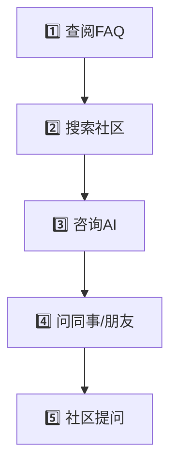

# 第十六章：常见问题FAQ

> 📖 **难度等级**: ⭐ (简单)
> ⏰ **预计阅读时间**: 40分钟
> 🎯 **学习目标**: 了解和解决vibe coding的常见问题

---

## 🎯 本章简介

本章收集了vibe coding中最常见的问题和解答，帮助你快速解决遇到的困难。

### FAQ的作用

```

遇到问题时：
❌ 自己摸索 → 浪费时间
✅ 查阅FAQ → 快速解决

FAQ的价值：
- 节省时间
- 避免重复踩坑
- 学习他人经验
- 快速找到答案
```

---

## 🤔 基础问题

### Q1: vibe coding完全不需要学编程吗？

**A:** 不完全是。vibe coding大大降低了编程门槛，但你仍然需要：

```

必须学习的：
✅ 基本逻辑思维
✅ 理解代码的能力
✅ 问题解决的思路

可以减少学习的：
❌ 复杂的语法记忆
❌ 框架的详细用法
❌ 大量手写代码

建议的学习路径：
1. 先用vibe coding做项目
2. 理解AI生成的代码
3. 逐渐学习基础知识
4. 能力越来越强
```

### Q2: AI生成的代码可靠吗？

**A:** 需要审查和验证。AI代码的优势和风险：

```

优势：
✅ 通常功能正确
✅ 遵循最佳实践
✅ 包含错误处理

风险：
❌ 可能有小bug
❌ 安全问题需要审查
❌ 性能可能不是最优

最佳实践：
1. 不要盲目接受AI代码
2. 仔细审查关键部分
3. 充分测试
4. 安全代码要自己确认
```

### Q3: 学vibe coding会让我变笨吗？

**A:** 不会，只要正确使用：

```

正确使用：
✅ 理解AI生成的代码
✅ 思考为什么这样写
✅ 能自己解释代码
✅ 遇到问题自己先思考

错误使用：
❌ 不理解就用
❌ 不思考直接复制
❌ 过度依赖AI
❌ 放弃学习能力

类比：
- 计算器让数学运算变快
- 但不代表数学能力消失
- 正确使用反而能学到更多

vibe coding也是同理
```

### Q4: vibe coding适合什么水平的人？

**A:** 几乎所有水平都适合！

```

完全零基础：
✅ 可以快速上手
✅ 完成简单项目
✅ 培养编程兴趣
⚠️ 需要花时间理解代码

有编程基础：
✅ 大幅提高效率
✅ 学习新技术更快
✅ 专注于复杂逻辑

资深开发者：
✅ 提升生产力
✅ 探索新可能性
✅ 带来新思路

结论：vibe coding是所有水平的人都受益的工具
```

---

## 🛠️ 工具使用问题

### Q5: Trae、Cursor、Claude Code选哪个？

**A:** 根据你的情况选择：

```

选择Trae，如果你：
✅ 是完全的初学者
✅ 主要用中文
✅ 想要免费工具
✅ 希望简单易用

选择Cursor，如果你：
✅ 有一点编程经验
✅ 喜欢VS Code界面
✅ 想要强大功能
✅ 有一定预算（专业版）

选择Claude Code，如果你：
✅ 是专业开发者
✅ 需要命令行集成
✅ 已经有Claude付费账号
✅ 想要最专业的工具

参考：可以多个工具都试试，找到最适合你的
```

### Q6: AI响应很慢怎么办？

**A:** 多种原因和解决方案：

```

原因1：网络问题
解决：
- 检查网络连接
- 尝试切换网络
- 使用更快的网络

原因2：项目太大
解决：
- 使用忽略文件（.claudeignore等）
- 只让AI处理特定文件
- 减少包含的上下文

原因3：免费额度限制
解决：
- 升级到付费版
- 等待额度重置
- 换个时间段再试

原因4：AI服务器繁忙
解决：
- 稍后再试
- 换个AI模型（如果工具支持）
```

### Q7: AI不理解我的需求怎么办？

**A:** 改进你描述需求的方式：

```

问题示例：
❌ "做个网页"（太笼统）
❌ "改一下"（不清楚）
❌ "不行"（没有上下文）

改进方法：

方法1：更具体
✅ "做一个个人博客网页，包含文章列表、详情页、侧边栏"

方法2：提供示例
✅ "参考这个设计：[示例链接]，用类似风格"

方法3：分步骤
✅ "先创建基础页面"
✅ "然后添加文章列表"
✅ "再添加详情页"

方法4：给背景
✅ "我是初学者，在学习React"
✅ "这是一个电商网站"
✅ "主要目标是学习"
```

### Q8: 如何让AI遵循我的代码规范？

**A:** 使用配置文件和明确说明：

```

方法1：创建配置文件

.cursorrules:
"请遵循以下代码规范：
- 使用2空格缩进
- 使用单引号
- 函数名使用驼峰命名
- 常量使用全大写
- 每个函数添加JSDoc注释"

.claude.md:
[同上内容]

方法2：在提示词中明确说明

你：帮我写一个函数
代码规范：
- TypeScript
- 遵循项目的编码规范
- 添加完整的JSDoc注释

方法3：提供示例

你：按照这个风格写代码：
[粘贴符合规范的示例代码]
```

---

## 💻 技术问题

### Q9: AI生成的代码不能用怎么办？

**A:** 系统地排查问题：

```

步骤1：复制完整代码
确保没有遗漏

步骤2：检查语法错误
使用linter或IDE提示

步骤3：检查依赖
确保所需的库已安装

步骤4：让AI检查
你：我复制了你的代码，但报错：
[粘贴错误信息]
[粘贴相关代码]
请帮我检查

步骤5：分步验证
先运行最小示例
确认后再集成
```

### Q10: 如何处理AI生成的代码中的bug？

**A:** 系统的调试流程：

```

步骤1：定位bug
- 复现问题
- 记录错误信息

步骤2：让AI诊断
你：这段代码有bug：
[粘贴错误信息]
[粘贴相关代码]

步骤3：理解修复
AI给出修复方案后
- 问为什么这样修
- 理解修复原理
- 确保你理解了

步骤4：测试验证
- 测试修复后的代码
- 确认问题解决
- 检查是否引入新问题
```

### Q11: AI不理解项目结构怎么办？

**A:** 提供更多上下文：

```

方法1：描述项目结构

你：我的项目结构是这样的：

    src/
    ├── components/
    │   ├── Header/
    │   └── Sidebar/
    ├── pages/
    │   └── Home/
    └── utils/

请帮我理解这个结构

方法2：创建项目文档

PROJECT.md:
"## 项目概述
这是xxx项目

## 技术栈
- React 18
- TypeScript
- Tailwind CSS

## 目录结构
[详细说明]

## 开发规范
[列出规范]
"

让AI读取这个文档

方法3：逐步引导

你：先帮我理解Header组件
[粘贴Header代码]

你：现在帮我理解Sidebar组件
[粘贴Sidebar代码]

逐步让AI了解项目
```

### Q12: 如何优化AI生成的代码质量？

**A:** 明确质量和优化要求：

```

你：优化这段代码

优化要求：
1. 提高可读性
2. 添加错误处理
3. 提高性能
4. 遵循最佳实践
5. 添加详细注释

代码：
[粘贴代码]

请：
1. 解释原代码的问题
2. 说明优化方案
3. 提供优化后的代码
4. 解释为什么这样优化
```

---

## 🎓 学习问题

### Q13: 如何快速进步？

**A:** 系统的学习方法：

```

方法1：项目驱动学习

不要只看教程，直接做项目：
1. 选择一个想做的项目
2. 用AI快速搭建
3. 理解每一部分代码
4. 尝试自己修改
5. 遇到问题问AI

方法2：从简单到复杂

循序渐进：
✅ 第1个月：简单项目（个人网页、小工具）
✅ 第2个月：中等项目（待办事项、小型应用）
✅ 第3个月：复杂项目（完整应用）

方法3：刻意练习

针对性练习：
✅ 选择一个薄弱环节
✅ 专注练习一周
✅ 做多个相关练习
✅ 总结经验

方法4：定期review

每周总结：
✅ 这周学到了什么
✅ 有什么收获
✅ 遇到什么问题
✅ 下周计划学什么
```

### Q14: 看不懂AI生成的代码怎么办？

**A:** 多层次理解：

```

层次1：让AI解释

你：请详细解释这段代码
[粘贴代码]

要求：
1. 用简单的语言
2. 逐行解释
3. 用例子说明

层次2：画流程图

让AI帮你画流程图，
可视化代码逻辑

层次3：自己复述

尝试自己解释一遍：
"这个代码的功能是..."
"第一部分是做..."
"第二部分是做..."

层次4：修改测试

修改代码观察效果：
- 改变参数值
- 注释掉某部分
- 看结果如何变化

通过修改加深理解
```

### Q15: 如何建立编程知识体系？

**A:** 系统积累知识：

```

方法1：知识库整理

创建个人知识库：
1. 每天记录学到的知识
2. 按主题分类整理
3. 添加例子和代码
4. 定期review

分类示例：
- HTML/CSS知识
- JavaScript知识
- React知识
- 调试技巧
- 性能优化
- 安全知识

方法2：练习项目

针对每个知识点做项目：
学完React组件 → 做一个Todo
学完路由 → 做一个多页面应用
学完状态管理 → 做一个复杂应用

方法3：教学相长

尝试教别人：
- 写博客分享
- 录制教程
- 回答别人问题
- 教学中发现盲点

方法4：持续学习

跟上技术发展：
- 订阅技术博客
- 关注AI工具更新
- 参加技术社区
- 定期学习新内容
```

---

## 💼 职业问题

### Q16: 用AI写的代码找工作？

**A:** 需要说明和理解：

```

可以做的：
✅ 用AI辅助开发
✅ 用AI生成示例
✅ 用AI优化代码

不应该做的：
❌ 完全不理解代码
❌ 面试时无法解释
❌ 无法独立完成工作

面试关键：
1. 你能理解代码吗？
   - 能解释代码作用
   - 能说明设计思路
   - 能回答深入问题

2. 你能解决问题吗？
   - 遇到新问题能处理
   - 不完全依赖AI
   - 有独立思考能力

3. 你有编程思维吗？
   - 理解基本概念
   - 能设计解决方案
   - 能分析复杂问题

建议：
- 用AI辅助学习
- 理解生成的每一行代码
- 能自己修改和扩展
- 建立自己的知识体系
```

### Q17: 公司允许使用AI工具吗？

**A:** 视公司政策而定：

```

了解公司政策：
1. 查看公司文档
2. 询问技术负责人
3. 了解合规要求

常见情况：

允许使用的情况：
✅ 明确支持AI辅助
✅ 有统一的工具
✅ 有使用规范

部分允许的情况：
⚠️ 允许学习但不允许生产
⚠️ 某些项目不允许
⚠️ 需要代码审查

不允许的情况：
❌ 明确禁止使用
❌ 安全敏感项目
❌ 法律法规限制

建议：
- 先了解清楚政策
- 按规定使用
- 不要违反规则
- 与团队保持一致
```

### Q18: vibe coding会取代程序员吗？

**A:** 不会，但会改变程序员的工作方式：

```

历史经验：
- 编译器没有取代程序员
- IDE没有取代程序员
- 框架没有取代程序员
- AI也不会取代程序员

变化的是：
❓ 不再需要：记忆所有语法
❓ 不再需要：手写所有代码
❓ 不再需要：从零开始实现所有功能

更需要的是：
✅ 理解和设计能力
✅ 问题解决能力
✅ 架构设计能力
✅ 产品思维
✅ AI协作能力

未来的程序员：
- 更像是架构师
- 更像是产品负责人
- 更像是AI管理者

结论：AI让编程门槛降低，
但需要更高层次的能力
```

---

## 🔧 高级问题

### Q19: 如何处理AI的幻觉（hallucination）？

**A:** 验证和交叉检查：

```

什么是AI幻觉：
- AI编造不存在的事实
- AI给出错误的API
- AI使用不存在的库

处理方法：

方法1：验证API和库
- 检查官方文档
- 搜索相关资料
- 查看库的版本

方法2：测试关键功能
- 先测试基础功能
- 确认能正常工作
- 再继续开发

方法3：交叉验证
- 让另一个AI验证
- 搜索解决方案
- 查看社区讨论

方法4：渐进式使用
- 不要直接复制大段代码
- 分部分逐步实现
- 每部分都验证
```

### Q20: 如何在团队中推广vibe coding？

**A:** 系统推广策略：

```

阶段1：个人实践（1-2周）
- 自己先熟练使用
- 积累经验
- 准备案例

阶段2：小范围试点（2-4周）
- 在小团队中使用
- 收集反馈
- 调整方法

阶段3：正式推广（1-2月）
- 制定规范
- 组织培训
- 分享经验

阶段4：持续优化（持续）
- 定期分享
- 收集反馈
- 不断改进

关键：
- 从小到大
- 循序渐进
- 分享经验
- 建立规范
```

---

## 📝 问题汇总表

| 问题分类 | 常见问题 | 优先级 |
|---------|-----------|--------|
| 基础概念 | 需要学编程吗？AI可靠吗？ | 高 |
| 工具使用 | 选哪个工具？响应慢怎么办？ | 高 |
| 技术问题 | 代码不能用？有bug怎么办？ | 中 |
| 学习方法 | 如何快速进步？如何建立知识？ | 高 |
| 职业发展 | 找工作？公司政策？会被取代吗？ | 中 |
| 高级问题 | AI幻觉？团队推广？ | 低 |

---

## 🆘️ 获取更多帮助

### 官方渠道

**Trae：**
- 官网：https://www.trae.ai/
- 文档：官方帮助文档
- 社区：微信群、Discord

**Cursor：**
- 官网：https://cursor.com/
- 文档：官方文档
- 社区：Discord、Twitter

**Claude Code：**
- 官网：https://code.claude.com/
- 文档：官方文档
- 社区：Reddit、GitHub

### 社区资源

**问题搜索：**
- Stack Overflow
- GitHub Issues
- Reddit r/programming
- 中文社区（CSDN、掘金等）

**AI讨论：**
- r/ClaudeCode
- r/OnlyAICoding
- 国内AI社区

---

## 🧪 试一试：快速解决问题的魔法咒语

### 咒语1：让AI诊断问题

```prompt
我遇到了一个问题：[描述你的问题]

当前情况：
- 我正在使用：[工具名称]
- 我想做的是：[你的目标]
- 出现的问题：[具体表现]
- 我已经尝试：[你试过的方法]

请帮我：
1. 分析可能的原因（列出3-5个）
2. 按可能性排序
3. 给出每个原因对应的解决方法
4. 告诉我如何避免类似问题
```

### 咒语2：寻求替代方案

```prompt
我想实现[功能]，但遇到了[困难]。

请给我几个不同的实现方案：
1. 最简单的方案
2. 最可靠的方案
3. 性能最好的方案

对比它们的优缺点，帮我选择最适合的。
```

### 咒语3：学习新概念

```prompt
请用小学生能懂的话解释[概念名称]。

要求：
- 用生活中的比喻
- 给一个简单的例子
- 告诉我这个概念有什么用
- 不要使用其他专业术语
```

### 快速查找对照表

| 问题类型 | 先看哪个章节 |
|----------|-------------|
| 工具选择 | Q6, Q7 本章 |
| 安装问题 | 第03章准备工作 |
| 代码报错 | Q10, 第09章调试 |
| 学习方法 | Q14, Q15 本章 |
| 职业问题 | Q16-Q18 本章 |
| 复杂故障 | 第17章故障排除 |

---

## 📝 本章小结

### 你掌握了

| 知识领域 | 内容 |
|---------|------|
| 基础认知 | vibe coding的本质和价值 |
| 工具使用 | 工具选择和使用技巧 |
| 技术问题 | 代码问题和解决方案 |
| 学习方法 | 快速进步和知识体系 |
| 职业发展 | 找工作和公司政策 |
| 高级问题 | AI幻觉和团队推广 |

### 本章学到的魔法咒语

| 场景 | 咒语要点 |
|------|----------|
| 诊断问题 | "问题描述+已尝试+请分析原因" |
| 替代方案 | "给我几个不同的实现方案" |
| 学习概念 | "用小学生能懂的话解释" |

### 遇到问题的处理流程



### 思考题

1. 你最常遇到的问题是哪类？
2. 有没有遇到过FAQ没有覆盖的问题？
3. 如何建立自己的问题解决方案库？
4. **动手题**：用"咒语1"让AI帮你诊断一个你遇到的问题！

---

## 🚀 下一章预告

常见问题解决了！下一章我们将学习故障排除指南，帮你更系统地解决各种技术问题！

准备好深入排查问题了吗？让我们继续！🔧

---

## 📚 参考资料

- [Claude Code、Cursor、Trae、OpenCode怎么选？](https://zhuanlan.zhihu.com/p/1997265112491398234)
- [2026 刚开始AI Coding，应该怎么选工具？](https://m.aitntnews.com/newDetail.html?newId=21173)
- [The Last Human Advantage: Why 'Vibe Coding' and AI ...](https://medium.com/@Xeusdynamics/the-last-human-advantage-why-vibe-coding-and-ai-lazy-thinking-are-your-agency-s-biggest-risks-in-f650e4113b88)
- [2026 年开发者全景编程工具指南](https://aicoding.csdn.net/696d87857c1d88441d8dd7d8.html)
- [Claude封锁中国升级，一款国产三款形态AI编程工具突围了](https://cloud.tencent.com/developer/news/2994044)
