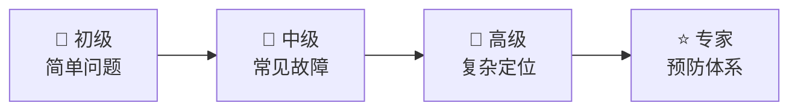

# 第十七章：故障排除指南

> 📖 **难度等级**: ⭐⭐⭐ (中等)
> ⏰ **预计阅读时间**: 45分钟
> 🎯 **学习目标**: 系统地诊断和解决技术问题

---

## 🎯 本章目标

学完本章，你将能够：
- ✅ 建立系统的问题排查流程
- ✅ 使用AI快速诊断问题
- ✅ 解决常见技术故障
- ✅ 建立问题记录和预防机制
- ✅ 提高问题解决效率

---

## 🔧 故障排除方法论

### 系统排查流程

**问题的标准处理流程：**


---

## 🚨 紧急问题快速响应

### 类型1：生产环境故障

```text
优先级：🔴 最高

处理步骤：

步骤1：立即评估
- 影响范围：全站/部分用户
- 影响程度：无法使用/功能受限
- 业务影响：收入损失/用户投诉

步骤2：快速止损
- 回滚到上一个稳定版本
- 切换到备用服务
- 显示维护页面

步骤3：深入分析
- 查看错误日志
- 分析监控数据
- 确定根本原因

步骤4：永久修复
- 修复问题
- 充分测试
- 灰度发布

步骤5：总结复盘
- 为什么没及时发现？
- 如何预防？
- 改进监控告警
```

### 类型2：开发环境故障

```text
优先级：🟡 中等

处理步骤：

步骤1：确定影响
- 影响哪些开发者？
- 阻碍什么工作？
- 有无临时方案？

步骤2：快速定位
- 最近更改了什么？
- 新安装了什么？
- 依赖是否更新？

步骤3：解决问题
- 查看错误信息
- 使用调试工具
- 咨询AI诊断

步骤4：记录问题
- 问题描述
- 解决过程
- 预防措施
```

### 类型3：AI工具故障

```text
优先级：🟡 中等

常见问题和解决：

问题：AI工具无法启动
解决：
- 检查网络连接
- 重启工具
- 检查版本兼容性
- 重新安装

问题：AI响应报错
解决：
- 检查账号状态
- 查看错误信息
- 联系客服
- 尝试备用工具

问题：AI输出异常
解决：
- 清除对话历史
- 重新描述需求
- 更换AI模型
- 检查提示词是否有误
```

---

## 🔍 常见故障排查

### 故障1：应用无法启动

```text
问题现象：
- 页面空白
- 报错无法加载
- 卡在加载状态
```

**排查步骤：**

**步骤1：检查控制台**

打开浏览器DevTools（F12）查看Console

**步骤2：分析错误信息**

常见错误：

```text
Uncaught TypeError: xxx is not a function
→ 调用了一个不是函数的东西

Uncaught ReferenceError: xxx is not defined
→ 使用了未定义的变量

SyntaxError: Unexpected token
→ 代码语法错误
```

**步骤3：让AI诊断**

```text
你：我的应用无法启动

错误信息：
[粘贴完整的错误信息]

相关代码：
[粘贴可能的错误代码]

环境信息：
- 浏览器：Chrome 120
- 框架：React 18
- 构建工具：Vite 5

请帮我：
1. 分析可能的原因
2. 提供排查步骤
3. 给出解决方案
```

### 故障2：功能不工作

```text
问题现象：
- 点击没反应
- 数据不显示
- 逻辑不符合预期
```

**排查步骤：**

**步骤1：缩小范围**
- 功能是否在所有环境下都不工作？
- 是否只有特定用户/浏览器有问题？
- 最近有相关代码变更吗？

**步骤2：检查数据流**

```text
数据来源 → 处理逻辑 → UI展示
   ↓         ↓         ↓
  检查     检查     检查
```

**步骤3：使用日志**

```javascript
// 添加日志追踪数据流
function handleData(data) {
    console.log('1. 接收到数据:', data);

    const processed = processData(data);
    console.log('2. 处理后数据:', processed);

    renderUI(processed);
    console.log('3. 渲染完成');
}
```

通过日志发现哪个环节出问题。

**步骤4：AI辅助**

```text
你：这个功能不工作

功能描述：
用户点击按钮后应该X，
实际结果是Y

相关代码：
[粘贴代码]

请帮我找出问题
```

### 故障3：性能突然变慢

```text
问题现象：
- 之前很快，突然变慢
- 特定操作变慢
- 加载时间增加
```

**排查步骤：**

**步骤1：确定变化时间**
- 什么时候开始的？
- 部署了新代码吗？
- 数据量增加了吗？

**步骤2：使用性能工具**

Chrome DevTools Performance:
1. 打开Performance标签
2. 点击Record
3. 执行慢的操作
4. 停止查看分析

**步骤3：检查资源**

Network标签检查：
- 哪个请求最慢？
- 资源大小是否过大？
- 有没有失败的请求？

**步骤4：AI分析性能**

```text
你：应用性能突然变慢

性能数据：
[粘贴Performance分析数据]
[粘贴Network数据]

近期变更：
- 更新了某个组件
- 增加了新功能

请帮我分析性能瓶颈
```

### 故障4：数据不一致

```text
问题现象：
- 显示数据和数据库不一致
- 不同地方显示不同
- 更新后没有变化
```

**排查步骤：**

**步骤1：数据流分析**

```text
用户输入 → 状态管理 → API请求 → 数据库 → 返回数据 → 更新状态 → UI更新
   ↓         ↓         ↓         ↓         ↓         ↓         ↓
 检查      检查      检查      检查      检查      检查      检查
```

**步骤2：检查缓存**

可能的问题：
- 前端缓存了旧数据
- 后端缓存了旧数据
- CDN缓存了旧数据

解决：
- 清除浏览器缓存
- 清除应用缓存
- 清除CDN缓存

**步骤3：AI诊断**

```text
你：出现数据不一致问题

场景：
用户更新了数据，
但界面没有反映

相关代码：
[粘贴数据更新代码]
[粘贴UI渲染代码]

请帮我找出数据流哪里出了问题
```

### 故障5：内存泄漏

```text
问题现象：
- 应用使用时间长了变慢
- 浏览器崩溃
- 内存占用持续增长
```

**排查步骤：**

**步骤1：使用内存工具**

Chrome DevTools Memory:
1. 打开Memory标签
2. 拍摄Heap Snapshot
3. 执行操作
4. 再次拍摄Snapshot
5. 对比找出泄漏的对象

**步骤2：检查常见原因**

常见内存泄漏原因：
- ❌ 事件监听器未移除
- ❌ 定时器未清除
- ❌ 闭包引用未释放
- ❌ DOM引用未清理

**步骤3：AI分析**

```text
你：应用有内存泄漏

Memory分析数据：
[粘贴Memory Snapshot对比]
[粘贴Detached DOM等信息]

相关代码：
[粘贴可能有问题的代码]

请帮我找出内存泄漏的地方
```

---

## 🤖 AI辅助故障排除

### 故障排除模板1：应用不工作

```text
你：帮我诊断应用问题

问题描述：
[详细描述问题]
- 问题现象：[具体说明]
- 什么时候开始的：[时间]
- 影响范围：[哪些功能/用户]

环境信息：
- 操作系统：[Windows/Mac/Linux]
- 浏览器：[Chrome/Safari/Edge]
- 设备：[桌面/平板/手机]

错误信息：
[粘贴完整的错误信息]

相关代码：
[粘贴相关代码]

复现步骤：
1. [步骤1]
2. [步骤2]
3. [步骤3]

已尝试的方法：
1. [方法1] - 结果：[成功/失败]
2. [方法2] - 结果：[成功/失败]

请帮我：
1. 分析可能的原因
2. 提供排查步骤
3. 给出解决方案
```

### 故障排除模板2：性能问题

```text
你：帮我分析性能问题

性能问题：
[描述性能问题]

性能数据：
[粘贴Lighthouse分数]
[粘贴Performance分析数据]
[粘贴Network请求数据]

性能指标：
- FCP: [数值] ms
- LCP: [数值] ms
- TTI: [数值] ms
- CLS: [数值]

近期变更：
- [列出最近的代码变更]
- [列出依赖更新]

请帮我：
1. 找出性能瓶颈
2. 提供优化方案
3. 按优先级排序
```

### 故障排除模板3：构建/部署问题

```text
你：帮我解决构建部署问题

问题类型：
[构建失败/部署失败/运行时错误]

错误信息：
[粘贴完整的错误日志]

构建配置：
[粘贴webpack/vite等配置]

环境信息：
- Node版本：[版本号]
- 包管理器：[npm/yarn/pnpm]
- 操作系统：[系统]

请帮我：
1. 分析错误原因
2. 提供修复方案
3. 预防类似问题
```

---

## 📋 故障记录模板

### 问题记录表

```text
问题ID: [自动编号]

基础信息：
- 问题描述：[清晰描述]
- 严重程度：[🔴高/🟡中/🟢低]
- 影响范围：[哪些功能/用户]
- 发现时间：[日期时间]

问题分析：
- 根本原因：[问题根本原因]
- 相关代码：[代码位置]
- 环境信息：[系统/浏览器/版本]

解决过程：
- 排查步骤：[详细步骤]
- 解决方案：[具体方案]
- 解决时间：[日期时间]

预防措施：
- 如何避免：[预防方法]
- 需要改进：[改进点]
- 文档更新：[是否更新文档]

相关资源：
- 相关讨论：[链接]
- 参考文档：[链接]
- AI对话：[对话记录]

状态：
- 状态：[已解决/待解决]
- 负责人：[姓名]
- 最后更新：[日期]
```

### 使用示例

```text
问题ID: PROD-2024-001

基础信息：
- 问题描述：用户无法登录，一直显示"登录失败"
- 严重程度：🔴 高
- 影响范围：所有用户
- 发现时间：2024-01-15 10:30

问题分析：
- 根本原因：Redis缓存服务异常，导致验证码无法获取
- 相关代码：auth/login.js:45-60
- 环境信息：生产环境，Redis 6.2

解决过程：
- 排查步骤：
  1. 检查日志发现Redis连接超时
  2. 确认Redis服务无响应
  3. 重启Redis服务
- 解决方案：重启Redis并设置自动重启
- 解决时间：2024-01-15 11:15

预防措施：
- 如何避免：添加Redis健康检查
- 需要改进：设置自动告警
- 文档更新：已更新故障处理文档

相关资源：
- 相关讨论：内部Jira链接
- 参考文档：Redis运维手册
- AI对话：[链接]

状态：
- 状态：已解决
- 负责人：张三
- 最后更新：2024-01-15 14:00
```

---

## 🛡️ 故障预防

### 预防措施1：充分的测试

```text
测试金字塔：

        /\
       /  \
      /E2E \
     /________\
    /          \
   / 集成测试   \
  /______________\
 /                \
/    单元测试       \
\__________________/
```

**具体要求：**

**单元测试：**
- 每个函数都要测试
- 覆盖正常和异常情况
- 测试覆盖率 > 80%

**集成测试：**
- 测试模块间交互
- 测试API接口
- 测试数据流

**E2E测试：**
- 测试完整用户流程
- 测试关键业务场景
- 多浏览器测试

### 预防措施2：监控告警

```text
三级监控：

L1：应用监控
- 错误监控
- 性能监控
- 用户行为监控

L2：服务监控
- 服务器健康
- 数据库状态
- 缓存状态

L3：业务监控
- 核心业务指标
- 用户活跃度
- 转化率
```

**告警规则：**
- 错误率 > 1% → 告警
- 响应时间 > 3秒 → 告警
- 服务可用 < 99% → 告警

### 预防措施3：灰度发布

```text
灰度发布流程：

1% → 5% → 10% → 50% → 100%
 ↓     ↓      ↓      ↓      ↓
观察  观察   观察   观察   全量
```

**回滚机制：**
- 发现问题立即回滚
- 保留上一个稳定版本
- 回滚过程快速自动化

**发布检查清单：**
- ☐ 所有测试通过
- ☐ 代码review完成
- ☐ 性能测试达标
- ☐ 监控正常
- ☐ 回滚预案就绪

---

## 📝 故障排除检查清单

### 问题发现阶段

```text
问题记录：
☐ 清晰描述问题
☐ 记录错误信息
☐ 记录复现步骤
☐ 记录影响范围
☐ 记录发生时间
```

### 问题分析阶段

```text
初步分析：
☐ 确定问题类型
☐ 评估严重程度
☐ 确定影响范围
☐ 查找相关代码
☐ 检查最近变更
```

### 问题解决阶段

```text
解决方案：
☐ 快速验证方法
☐ 使用调试工具
☐ AI辅助诊断
☐ 实施修复方案
☐ 测试验证效果
```

### 总结改进阶段

```text
经验总结：
☐ 记录问题原因
☐ 记录解决方案
☐ 更新文档
☐ 分享给团队
☐ 制定预防措施
```

---

## 📝 本章小结

### 你学会了

| 技能 | 内容 |
|-----|------|
| 系统排查 | 六步故障排除流程 |
| 快速响应 | 紧急问题处理方法 |
| 常见故障 | 五大类故障的排查 |
| AI辅助 | 故障排除的AI模板 |
| 预防措施 | 测试、监控、灰度发布 |
| 记录总结 | 问题记录模板和流程 |

### 故障排除能力进阶



### 思考题

1. 你最常遇到的问题类型是什么？
2. 你有记录问题的习惯吗？
3. 如何建立自己的故障排除体系？

---

## 🚀 下一章预告

故障排除完成！下一章是最后一章——资源推荐，帮你找到更多学习资源！

准备好继续探索了吗？让我们完成最后的学习！📚

---

## 📚 参考资料

- [My LLM coding workflow going into 2026](https://medium.com/@addyosmani/my-llm-coding-workflow-going-into-2026-52fe1681325e)
- [Best AI Coding Practices That Actually Work in 2026](https://www.linkedin.com/pulse/best-ai-coding-practices-actually-work-in-2026-big-pixel-llc-thz7c)
- [Getting Started with AI in 2026: The New Path](https://yuv.ai/learn/getting-started-ai-2026)
- [How to Learn Coding in 2026: A Practical Guide](https://dev.to/farhadrahimiklie/how-to-learn-coding-in-2026-a-practical-guide-that-actually-works-3f2l)
- [AI Debugging for Developers: A Beginner's Guide](https://www.linkedin.com/posts/simon-mumina-7a734022b_ai-powered-debugging-a-beginners-guide-activity-7418346103600730112--M16)
