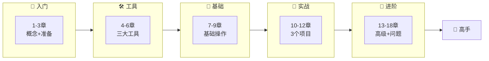

# 第十八章：资源推荐

> 📖 **难度等级**: ⭐ (简单)
> ⏰ **预计阅读时间**: 35分钟
> 🎯 **学习目标**: 发现更多学习资源，持续提升vibe coding能力

---

## 🎯 本章简介

vibe coding技术发展迅速，持续学习很重要。本章为你整理了2026年最新、最优质的学习资源。

### 资源分类

```

按类型分类：
📖 学习资源 - 教程、课程、文档
🛠️ 工具平台 - AI工具、开发平台
👥 社区论坛 - 讨论区、问答区
🎥 视频教程 - YouTube、B站等
📝 博客文章 - 技术博客、经验分享
🔧 开源项目 - 实战项目参考

按难度分类：
🌱 初学者 - 入门教程、基础指南
🌿 进阶者 - 实战项目、最佳实践
🌳 专家级 - 架构设计、性能优化
```

---

## 📖 官方资源

### Claude相关

| 资源 | 链接 | 说明 |
|-----|------|------|
| Claude官网 | https://claude.com | Claude AI产品主页 |
| Claude Code文档 | https://code.claude.com/docs | Claude Code官方文档 |
| Claude API文档 | https://docs.anthropic.com | Claude API使用文档 |
| Claude博客 | https://claude.com/blog | 最新动态和教程 |

### Cursor相关

| 资源 | 链接 | 说明 |
|-----|------|------|
| Cursor官网 | https://cursor.com | Cursor产品主页 |
| Cursor文档 | https://docs.cursor.sh | Cursor使用文档 |
| Cursor博客 | https://cursor.com/blog | 新功能和技巧 |
| Cursor Discord | 社区链接 | 官方Discord社区 |

### Trae相关

| 资源 | 链接 | 说明 |
|-----|------|------|
| Trae官网 | https://www.trae.ai | Trae产品主页 |
| Trae教程 | http://www.runoob.com/w3cnote/trae-tutorial.html | 菜鸟教程网站 |
| Trae文档 | 开发者中心 | 详细使用指南 |

---

## 🛠️ AI编程工具

### 主流工具对比

| 工具 | 难度 | 价格 | 特色 | 官网 |
|-----|------|------|------|------|
| Claude Code | ⭐⭐⭐ | 付费 | 命令行集成 | code.claude.com |
| Cursor | ⭐⭐ | 部分免费 | VS Code界面 | cursor.com |
| Trae | ⭐ | 免费 | 中文优化 | trae.ai |
| Replit | ⭐⭐ | 免费+付费 | 在线开发 | replit.com |
| Bolt.new | ⭐ | 免费 | 快速原型 | bolt.new |
| Lovable | ⭐⭐ | 免费+付费 | 全栈开发 | lovable.dev |
| Windsurf | ⭐⭐ | 免费 | AI编辑器 | windsurf.ai |

### 其他值得一试的工具

**新兴工具：**
- [OpenCode](https://opencode.com/) - 开源代码助手
- [Augment](https://augmentcode.com/) - 智能补全
- [Codium](https://codium.com/) - AI代码助手
- [Tabnine](https://www.tabnine.com/) - AI自动补全

**评测对比：**
- [10 Best Vibe Coding Tools in 2026](https://manus.im/blog/best-vibe-coding-tools)
- [Vibe Coding Tools Guide: Best AI App Builders 2026](https://replit.com/discover/best-vibe-coding-tools)

---

## 📚 学习教程

### 入门教程

| 教程 | 平台 | 难度 | 内容 |
|-----|------|------|------|
| [Learn to Vibe Code in 10 Minutes](https://www.youtube.com/watch?v=-LFB8D9WV-g) | YouTube | ⭐ | 10分钟快速入门 |
| [Getting Started with Vibe Coding](https://emergent.sh/learn/how-to-start-vibe-coding) | 网页 | ⭐⭐ | 从零开始学习 |
| [Vibe Coding Guide for Beginners](https://www.vibecodingacademy.ai/vibe-coding-courses-comparison) | 网站 | ⭐⭐⭐ | 系统的课程对比 |
| [Learn Vibe Coding with AI Tools](https://www.mygreatlearning.com/academy/learn-for-free/courses/learn-vibe-coding-with-ai-tools) | 平台 | ⭐ | 免费课程 |

### 进阶教程

| 教程 | 平台 | 难度 | 内容 |
|-----|------|------|------|
| [Vibe Coding in 2026: Complete Guide](https://dev.to/pockit_tools/vibe-coding-in-2026-the-complete-guide-to-ai-pair-programming-that-actually-works-42de) | Dev.to | ⭐⭐⭐ | 实用工作流 |
| [My LLM coding workflow 2026](https://medium.com/@addyosmani/my-llm-coding-workflow-going-into-2026-52fe1681325e) | Medium | ⭐⭐⭐⭐ | Addy Osmani的经验 |
| [Best AI Coding Practices 2026](https://www.linkedin.com/pulse/best-ai-coding-practices-actually-work-in-2026-big-pixel-llc-thz7c) | LinkedIn | ⭐⭐⭐⭐ | 最佳实践 |
| [AI for Vibe Coding](https://www.coursera.org/learn/ai-for-vibe-coding) | Coursera | ⭐⭐⭐ | 结构化课程 |

### 中文资源

| 资源 | 平台 | 难度 | 内容 |
|-----|------|------|------|
| [Claude Code、Cursor、Trae怎么选？](https://zhuanlan.zhihu.com/p/1997265112491398234) | 知乎 | ⭐⭐ | 工具选择指南 |
| [主流AI编程助手对比](https://blog.csdn.net/jlq_diligence/article/details/156577225) | CSDN | ⭐⭐⭐ | 功能对比分析 |
| [datawhalechina/easy-vibe](https://github.com/datawhalechina/easy-vibe) | GitHub | ⭐⭐⭐ | 从0到1教程 |

---

## 👥 社区与论坛

### 国际社区

| 社区 | 平台 | 活跃度 | 特色 |
|-----|------|--------|------|
| r/ClaudeCode | Reddit | 高 | Claude Code讨论 |
| r/OnlyAICoding | Reddit | 高 | AI编程讨论 |
| r/vibecoding | Reddit | 中 | vibe coding讨论 |
| Cursor Discord | Discord | 高 | Cursor官方社区 |
| Claude Discord | Discord | 高 | Claude官方社区 |

### 中文社区

| 社区 | 平台 | 活跃度 | 特色 |
|-----|------|--------|------|
| 掘金 | 网站 | 高 | 前端技术社区 |
| CSDN | 网站 | 高 | 综合技术社区 |
| V2EX | 论坛 | 中 | 程序员社区 |
| 知乎编程话题 | 知乎 | 高 | 技术问答 |

---

## 🎥 视频教程

### 英文视频

| 频道/视频 | 平台 | 时长 | 内容 |
|----------|------|------|------|
| [Learn to Vibe Code in 10 Minutes](https://www.youtube.com/watch?v=-LFB8D9WV-g) | YouTube | 10分钟 | 快速入门 |
| [How to Build an App with AI 2026](https://www.youtube.com/watch?v=4FjleDsZlmo) | YouTube | 45分钟 | 完整项目 |
| [How I'd Learn Coding in 2026](https://www.youtube.com/watch?v=U-L7ZkROK2Q) | YouTube | 30分钟 | 学习路径 |
| [Cursor Tutorial for Beginners](https://www.youtube.com/watch?v=6q8joS_592k) | YouTube | 30分钟 | Cursor教程 |

### 中文视频

搜索关键词：
- "vibe coding 教程"
- "AI编程 入门"
- "Claude Code 使用"
- "Cursor 使用教程"
- "Trae 教程"

推荐平台：
- B站
- 抖音
- 小红书
- YouTube中文频道

---

## 📝 技术博客

### 英文博客

| 博客/作者 | 更新频率 | 特色 |
|----------|---------|------|
| [Claude Blog](https://claude.com/blog) | 每周 | 官方更新和教程 |
| [Cursor Blog](https://cursor.com/blog) | 每月 | 新功能发布 |
| [Anthropic AI Safety](https://www.anthropic.com/safety) | 不定期 | 安全相关文章 |
| [Addy Osmani's Blog](https://addyosmani.com/) | 每月 | 前端最佳实践 |
| [ProductTalk](https://www.producttalk.org/) | 每周 | AI产品分析 |

### 中文博客

| 博客/平台 | 更新频率 | 特色 |
|----------|---------|------|
| [AI编程教程](https://aicoding.csdn.net/) | 每周 | AI编程经验 |
| [Claude封锁中国升级](https://cloud.tencent.com/developer/news/2994044) | 不定期 | 行业动态 |
| [2026开发者工具指南](https://aicoding.csdn.net/696d87857c1d88441d8dd7d8.html) | 不定期 | 工具对比 |

---

## 🔧 开源项目

### 学习项目

| 项目 | 技术栈 | 难度 | 适合学习 |
|-----|---------|------|---------|
| [datawhalechina/easy-vibe](https://github.com/datawhalechina/easy-vibe) | 多种 | ⭐⭐⭐ | vibe coding教程 |
| [FlorianBruniaux/claude-code-ultimate-guide](https://github.com/FlorianBruniaux/claude-code-ultimate-guide) | Claude Code | ⭐⭐⭐⭐ | Claude Code指南 |
| [vibecoding/example-projects](GitHub搜索) | 多种 | ⭐⭐ | 示例项目集合 |

### 实战项目参考

按项目类型搜索：

**前端项目：**
- GitHub: "vibe coding frontend"
- GitHub: "AI generated website"
- GitHub: "cursor project"

**全栈项目：**
- GitHub: "vibe coding fullstack"
- GitHub: "AI app template"
- GitHub: "Claude Code project"

**工具类项目：**
- GitHub: "AI utility"
- GitHub: "CLI tool"
- GitHub: "automation script"

---

## 📊 学习路径推荐

### 初学者路径

```

第1周：基础入门
Day 1-2: 阅读本教程前3章
Day 3-4: 安装一个AI工具
Day 5-7: 完成第一个网页项目

第2周：巩固练习
Day 1-3: 完成待办事项应用
Day 4-5: 尝试修改项目
Day 6-7: 开始自己的小项目

第3-4周：深入学习
学习提示词技巧
学习代码理解
学习调试方法

第2月：项目实战
完成一个完整的项目
分享给朋友
收集反馈改进
```

### 进阶者路径

```

第1-2周：学习高级技巧
提示词工程进阶
代码优化技巧
性能优化方法

第3-4周：复杂项目
完成复杂项目
学习新框架
挑战新功能

第2月：团队协作
尝试在团队中使用
建立规范
分享经验
```

### 专家路径

```

持续改进：
- 跟踪最新技术
- 贡献开源项目
- 分享学习经验
- 帮助他人学习
- 创造新的方法
```

---

## 🔍 如何发现新资源

### 方法1：关注官方渠道

**值得关注的：**
- 各工具的官方博客
- 各工具的Twitter/X账号
- 各工具的Discord社区
- 各工具的YouTube频道

### 方法2：订阅技术媒体

**推荐的订阅：**
- AI技术周刊
- 编程技术订阅
- 科技媒体推送
- 技术博客RSS

### 方法3：参与社区

**参与方式：**
- 回答社区问题
- 分享你的经验
- 参与技术讨论
- 参加线下活动
- 贡献开源项目

---

## 📝 资源整理技巧

### 建立个人资源库

```

分类整理：
📁 AI工具/
   ├── Claude Code/
   ├── Cursor/
   ├── Trae/
   └── 其他/

📁 教程/
   ├── 入门/
   ├── 进阶/
   └── 项目实战/

📁 项目参考/
   ├── 前端/
   ├── 后端/
   └── 全栈/

📁 问题解决/
   ├── 常见问题/
   ├── 调试技巧/
   └── 经验总结/
```

### 使用工具管理

**推荐工具：**
- Notion - 知识库
- Obsidian - 笔记工具
- Raindrop.io - 书签管理
- Pocket - 稍后读
- RSS阅读器 - 订阅更新

---

## ✅ 学习检查清单

### 基础能力

```

☐ 了解3个以上AI工具
☐ 能独立使用AI写代码
☐ 能理解AI生成的代码
☐ 能调试常见问题
☐ 完成过2个以上项目
```

### 进阶能力

```

☐ 掌握提示词技巧
☐ 能优化代码质量
☐ 能处理复杂需求
☐ 建立了自己的知识库
☐ 能帮助他人解决问题
```

### 持续学习

```

☐ 有固定的学习时间
☐ 订阅了技术更新
☐ 参与社区讨论
☐ 记录学习笔记
☐ 有长期学习计划
```

---

## 📝 本章小结

### 你拥有了

| 资源类型 | 数量 | 质量 |
|---------|-----|------|
| 官方资源 | 3个平台 | 权威 |
| AI工具 | 10+个工具 | 全面 |
| 学习教程 | 10+个教程 | 系统 |
| 社区论坛 | 8+个社区 | 活跃 |
| 视频教程 | 7+个视频 | 生动 |
| 技术博客 | 8+个博客 | 及时 |
| 开源项目 | 多个 | 实战 |

### 持续学习的习惯

```

每日：
✅ 关注技术动态
✅ 练习30分钟
✅ 记录学到的内容

每周：
✅ 完成一个小项目
✅ 参与社区讨论
✅ 整理学习笔记

每月：
✅ 学习一个新技术
✅ 分享学习经验
✅ 调整学习计划

持续：
✅ 保持好奇心
✅ 勇于尝试
✅ 乐于分享
```

---

## 🎉 恭喜完成教程！

你已经完成了整个vibe coding从入门到精通教程！

### 你的学习历程



### 你现在的能力

| 能力领域 | 你的水平 |
|---------|---------|
| 基础概念 | ✅ 了解vibe coding的核心 |
| 工具使用 | ✅ 掌握主流AI工具 |
| 代码编写 | ✅ 能用AI生成代码 |
| 代码理解 | ✅ 能理解和修改代码 |
| 问题解决 | ✅ 能独立解决问题 |
| 项目开发 | ✅ 能完成完整项目 |
| 高级技巧 | ✅ 掌握最佳实践 |
| 持续学习 | ✅ 有学习资源和方法 |

### 下一步建议

```

短期（1-3个月）：
1. 练习完成更多项目
2. 深入学习一个框架
3. 参与社区讨论
4. 帮助他人学习

中期（3-6个月）：
1. 贡献开源项目
2. 分享学习经验
3. 尝试在团队中使用
4. 建立自己的规范

长期（6个月+）：
1. 成为某个领域的专家
2. 创造自己的工具/方法
3. 推动vibe coding发展
4. 帮助更多人入门
```

### 最后的话

```

vibe coding是工具，你是创造者。

AI可以帮助你，
但真正的价值来自你——
你的创意、你的思考、你的坚持。

保持学习，保持探索，
用vibe coding创造更多可能性！

未来的编程世界，
会因为你的参与而更加精彩！

加油！💪🚀
```

---

## 📚 完整参考资料汇总

### 本教程所有引用的资源

**官方资源：**
- [Claude Code](https://code.claude.com/docs/en/setup)
- [Cursor](https://cursor.com/)
- [Trae](https://www.trae.ai/)

**AI编程基础：**
- [What is Vibe Coding](https://emergent.sh/learn/what-is-vibe-coding)
- [Getting Started with Vibe Coding](https://emergent.sh/learn/how-to-start-vibe-coding)
- [Vibe Coding in 2026](https://dev.to/pockit_tools/vibe-coding-in-2026-the-complete-guide-to-ai-pair-programming-that-actually-works-42de)

**工具对比：**
- [Claude Code vs Cursor](https://www.atcyrus.com/stories/claude-code-vs-cursor-comparison-2026)
- [Claude Code、Cursor、Trae怎么选？](https://zhuanlan.zhihu.com/p/1997265112491398234)
- [10 Best Vibe Coding Tools](https://manus.im/blog/best-vibe-coding-tools)

**最佳实践：**
- [Best AI Coding Practices 2026](https://www.linkedin.com/pulse/best-ai-coding-practices-actually-work-in-2026-big-pixel-llc-thz7c)
- [My LLM coding workflow](https://medium.com/@addyosmani/my-llm-coding-workflow-going-into-2026-52fe1681325e)
- [Best practices for prompt engineering](https://claude.com/blog/best-practices-for-prompt-engineering)

**团队协作：**
- [Claude Skills and CLAUDE.md](https://www.gend.co/blog/claude-skills-claude-md-guide)
- [The Best AI Coding Practices](https://bigpixel.io/blog/the-best-ai-coding-practices-that-actually-work-in-2026)

**调试与优化：**
- [AI Debugging](https://www.linkedin.com/posts/simon-mumina-7a734022b_ai-powered-debugging-a-beginner-guide-activity-7418346103600730112--M16)
- [Getting Started with AI in 2026](https://yuv.ai/learn/getting-started-ai-2026)

**教程与课程：**
- [Learn to Vibe Code in 10 Minutes](https://www.youtube.com/watch?v=-LFB8D9WV-g)
- [How to Build an App with AI](https://www.youtube.com/watch?v=4FjleDsZlmo)
- [Learn Vibe Coding with AI Tools](https://www.mygreatlearning.com/academy/learn-for-free/courses/learn-vibe-coding-with-ai-tools)
- [AI for Vibe Coding](https://www.coursera.org/learn/ai-for-vibe-coding)

**中文资源：**
- [Trae 教程](http://www.runoob.com/w3cnote/trae-tutorial.html)
- [datawhalechina/easy-vibe](https://github.com/datawhalechina/easy-vibe)
- [Trae 智能编程工具入门](https://aicoding.csdn.net/69611b17ea53844658f5ba71.html)
- [从零开始学Trae](https://developer.aliyun.com/article/1704521)
- [2026年开发者全景指南](https://aicoding.csdn.net/696d87857c1d88441d8dd7d8.html)

**开源项目：**
- [Claude Code Ultimate Guide](https://github.com/FlorianBruniaux/claude-code-ultimate-guide)
- [Tips and Tricks for AI Coder](https://github.com/techcow2/Tips-Tricks-for-AI-Coder)

---

## 🎓 结语

恭喜你完成了整个教程！

现在，你已经是一个合格的vibe coder了。

保持学习的热情，继续探索，不断进步！

**vibe coding的未来，等你来创造！** 🌟

---

**教程完**
